# Solara Data Flow Documentation

**Version:** 1.0
**Date:** 2026-01-01

This document describes the critical data flows in the Solara application using Mermaid diagrams.

---

## 1. Authentication Flow

### 1.1 Email/Password Sign-In

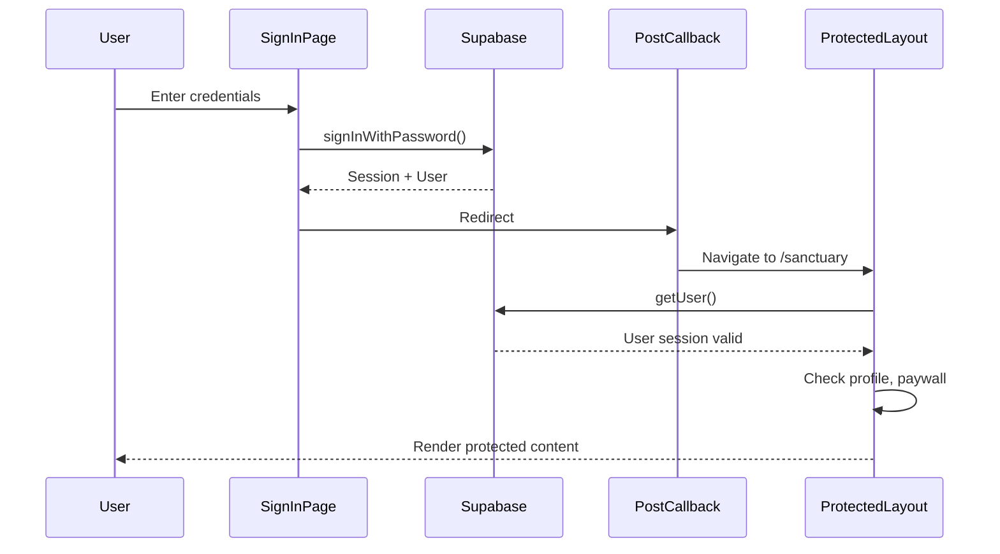
```mermaid
sequenceDiagram
    participant User
    participant SignInPage
    participant Supabase
    participant PostCallback
    participant ProtectedLayout

    User->>SignInPage: Enter credentials
    SignInPage->>Supabase: signInWithPassword()
    Supabase-->>SignInPage: Session + User
    SignInPage->>PostCallback: Redirect
    PostCallback->>ProtectedLayout: Navigate to /sanctuary
    ProtectedLayout->>Supabase: getUser()
    Supabase-->>ProtectedLayout: User session valid
    ProtectedLayout->>ProtectedLayout: Check profile, paywall
    ProtectedLayout-->>User: Render protected content
```

### 1.2 OAuth Sign-In (Facebook Example)

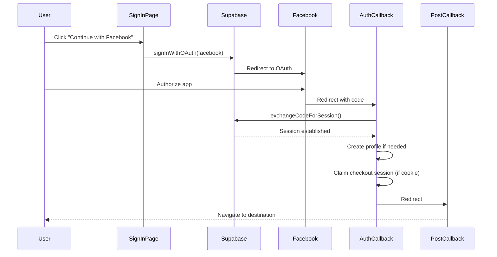
```mermaid
sequenceDiagram
    participant User
    participant SignInPage
    participant Supabase
    participant Facebook
    participant AuthCallback
    participant PostCallback

    User->>SignInPage: Click "Continue with Facebook"
    SignInPage->>Supabase: signInWithOAuth(facebook)
    Supabase->>Facebook: Redirect to OAuth
    User->>Facebook: Authorize app
    Facebook->>AuthCallback: Redirect with code
    AuthCallback->>Supabase: exchangeCodeForSession()
    Supabase-->>AuthCallback: Session established
    AuthCallback->>AuthCallback: Create profile if needed
    AuthCallback->>AuthCallback: Claim checkout session (if cookie)
    AuthCallback->>PostCallback: Redirect
    PostCallback-->>User: Navigate to destination
```

### 1.3 Protected Route Access Control

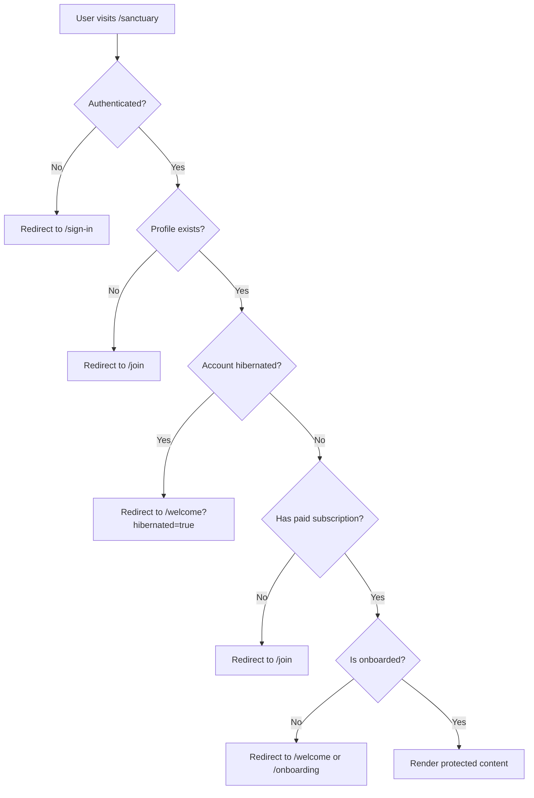
```mermaid
flowchart TD
    A[User visits /sanctuary] --> B{Authenticated?}
    B -->|No| C[Redirect to /sign-in]
    B -->|Yes| D{Profile exists?}
    D -->|No| E[Redirect to /join]
    D -->|Yes| F{Account hibernated?}
    F -->|Yes| G[Redirect to /welcome?hibernated=true]
    F -->|No| H{Has paid subscription?}
    H -->|No| I[Redirect to /join]
    H -->|Yes| J{Is onboarded?}
    J -->|No| K[Redirect to /welcome or /onboarding]
    J -->|Yes| L[Render protected content]
```

---

## 2. Payment Flow

### 2.1 Checkout Session Creation

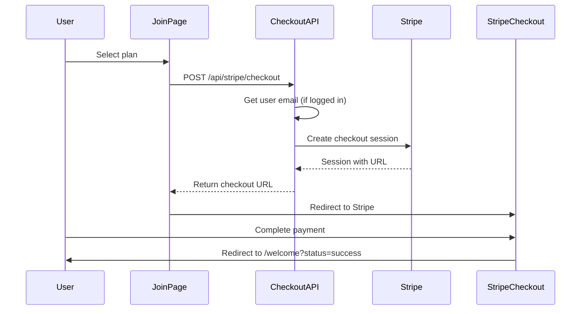
```mermaid
sequenceDiagram
    participant User
    participant JoinPage
    participant CheckoutAPI
    participant Stripe
    participant StripeCheckout

    User->>JoinPage: Select plan
    JoinPage->>CheckoutAPI: POST /api/stripe/checkout
    CheckoutAPI->>CheckoutAPI: Get user email (if logged in)
    CheckoutAPI->>Stripe: Create checkout session
    Stripe-->>CheckoutAPI: Session with URL
    CheckoutAPI-->>JoinPage: Return checkout URL
    JoinPage->>StripeCheckout: Redirect to Stripe
    User->>StripeCheckout: Complete payment
    StripeCheckout->>User: Redirect to /welcome?status=success
```

### 2.2 Webhook Processing

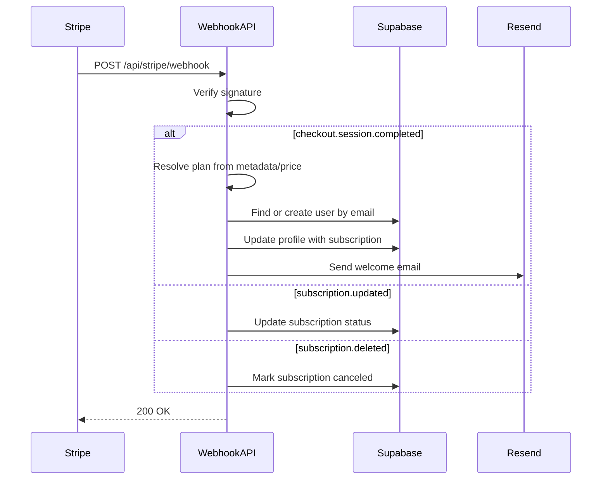
```mermaid
sequenceDiagram
    participant Stripe
    participant WebhookAPI
    participant Supabase
    participant Resend

    Stripe->>WebhookAPI: POST /api/stripe/webhook
    WebhookAPI->>WebhookAPI: Verify signature

    alt checkout.session.completed
        WebhookAPI->>WebhookAPI: Resolve plan from metadata/price
        WebhookAPI->>Supabase: Find or create user by email
        WebhookAPI->>Supabase: Update profile with subscription
        WebhookAPI->>Resend: Send welcome email
    else subscription.updated
        WebhookAPI->>Supabase: Update subscription status
    else subscription.deleted
        WebhookAPI->>Supabase: Mark subscription canceled
    end

    WebhookAPI-->>Stripe: 200 OK
```

### 2.3 Checkout Session Claiming

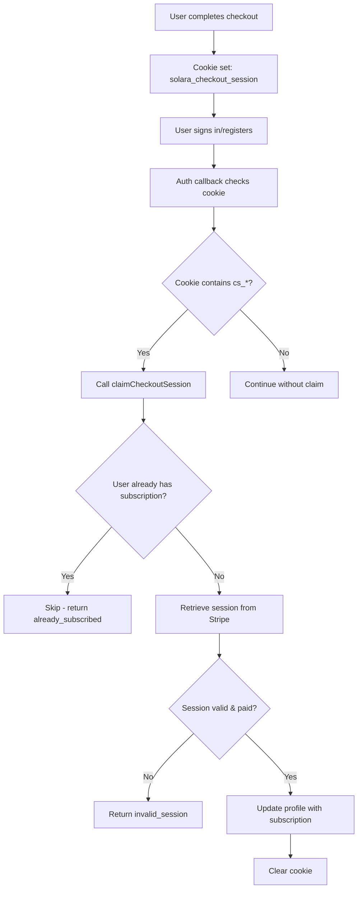
```mermaid
flowchart TD
    A[User completes checkout] --> B[Cookie set: solara_checkout_session]
    B --> C[User signs in/registers]
    C --> D[Auth callback checks cookie]
    D --> E{Cookie contains cs_*?}
    E -->|Yes| F[Call claimCheckoutSession]
    F --> G{User already has subscription?}
    G -->|Yes| H[Skip - return already_subscribed]
    G -->|No| I[Retrieve session from Stripe]
    I --> J{Session valid & paid?}
    J -->|No| K[Return invalid_session]
    J -->|Yes| L[Update profile with subscription]
    L --> M[Clear cookie]
    E -->|No| N[Continue without claim]
```

---

## 3. AI Insight Generation Flow

### 3.1 Insight Request with Caching

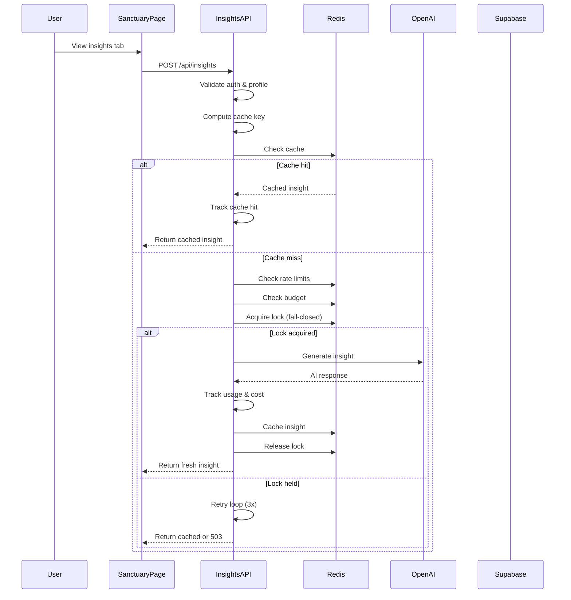
```mermaid
sequenceDiagram
    participant User
    participant SanctuaryPage
    participant InsightsAPI
    participant Redis
    participant OpenAI
    participant Supabase

    User->>SanctuaryPage: View insights tab
    SanctuaryPage->>InsightsAPI: POST /api/insights
    InsightsAPI->>InsightsAPI: Validate auth & profile
    InsightsAPI->>InsightsAPI: Compute cache key
    InsightsAPI->>Redis: Check cache

    alt Cache hit
        Redis-->>InsightsAPI: Cached insight
        InsightsAPI->>InsightsAPI: Track cache hit
        InsightsAPI-->>SanctuaryPage: Return cached insight
    else Cache miss
        InsightsAPI->>Redis: Check rate limits
        InsightsAPI->>Redis: Check budget
        InsightsAPI->>Redis: Acquire lock (fail-closed)

        alt Lock acquired
            InsightsAPI->>OpenAI: Generate insight
            OpenAI-->>InsightsAPI: AI response
            InsightsAPI->>InsightsAPI: Track usage & cost
            InsightsAPI->>Redis: Cache insight
            InsightsAPI->>Redis: Release lock
            InsightsAPI-->>SanctuaryPage: Return fresh insight
        else Lock held
            InsightsAPI->>InsightsAPI: Retry loop (3x)
            InsightsAPI-->>SanctuaryPage: Return cached or 503
        end
    end
```

### 3.2 Cost Control Circuit Breaker

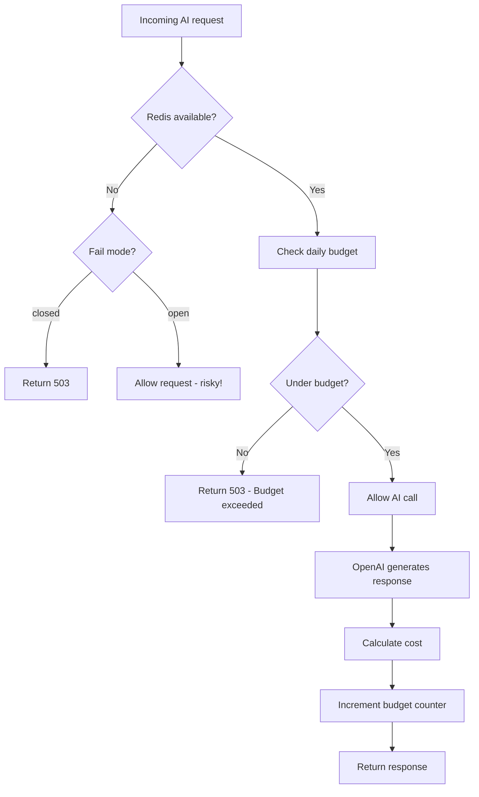
```mermaid
flowchart TD
    A[Incoming AI request] --> B{Redis available?}
    B -->|No| C{Fail mode?}
    C -->|closed| D[Return 503]
    C -->|open| E[Allow request - risky!]
    B -->|Yes| F[Check daily budget]
    F --> G{Under budget?}
    G -->|No| H[Return 503 - Budget exceeded]
    G -->|Yes| I[Allow AI call]
    I --> J[OpenAI generates response]
    J --> K[Calculate cost]
    K --> L[Increment budget counter]
    L --> M[Return response]
```

### 3.3 Model Selection Logic

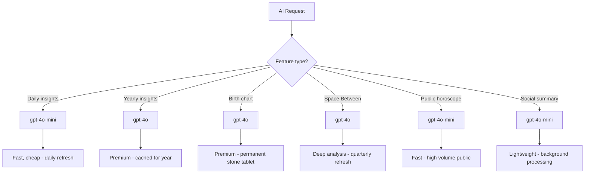
```mermaid
flowchart TD
    A[AI Request] --> B{Feature type?}

    B -->|Daily insights| C[gpt-4o-mini]
    B -->|Yearly insights| D[gpt-4o]
    B -->|Birth chart| E[gpt-4o]
    B -->|Space Between| F[gpt-4o]
    B -->|Public horoscope| G[gpt-4o-mini]
    B -->|Social summary| H[gpt-4o-mini]

    C --> I[Fast, cheap - daily refresh]
    D --> J[Premium - cached for year]
    E --> K[Premium - permanent stone tablet]
    F --> L[Deep analysis - quarterly refresh]
    G --> M[Fast - high volume public]
    H --> N[Lightweight - background processing]
```

---

## 4. Social Integration Flow

### 4.1 Social OAuth Connection

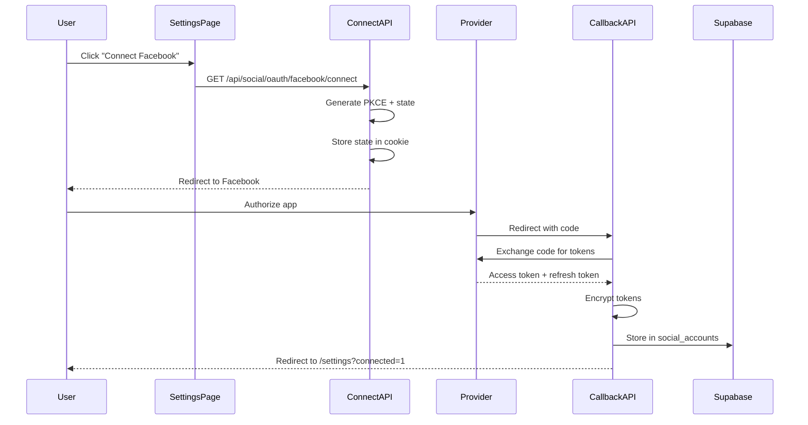
```mermaid
sequenceDiagram
    participant User
    participant SettingsPage
    participant ConnectAPI
    participant Provider
    participant CallbackAPI
    participant Supabase

    User->>SettingsPage: Click "Connect Facebook"
    SettingsPage->>ConnectAPI: GET /api/social/oauth/facebook/connect
    ConnectAPI->>ConnectAPI: Generate PKCE + state
    ConnectAPI->>ConnectAPI: Store state in cookie
    ConnectAPI-->>User: Redirect to Facebook
    User->>Provider: Authorize app
    Provider->>CallbackAPI: Redirect with code
    CallbackAPI->>Provider: Exchange code for tokens
    Provider-->>CallbackAPI: Access token + refresh token
    CallbackAPI->>CallbackAPI: Encrypt tokens
    CallbackAPI->>Supabase: Store in social_accounts
    CallbackAPI-->>User: Redirect to /settings?connected=1
```

### 4.2 Social Sync Pipeline

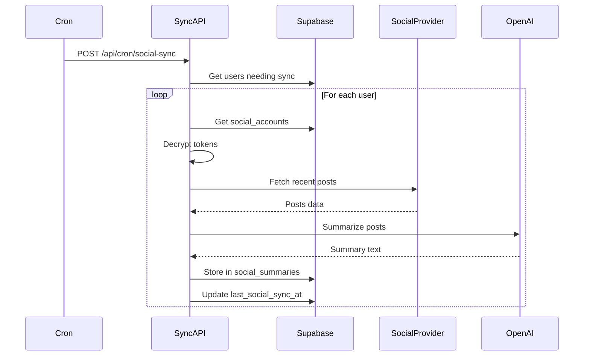
```mermaid
sequenceDiagram
    participant Cron
    participant SyncAPI
    participant Supabase
    participant SocialProvider
    participant OpenAI

    Cron->>SyncAPI: POST /api/cron/social-sync
    SyncAPI->>Supabase: Get users needing sync

    loop For each user
        SyncAPI->>Supabase: Get social_accounts
        SyncAPI->>SyncAPI: Decrypt tokens
        SyncAPI->>SocialProvider: Fetch recent posts
        SocialProvider-->>SyncAPI: Posts data
        SyncAPI->>OpenAI: Summarize posts
        OpenAI-->>SyncAPI: Summary text
        SyncAPI->>Supabase: Store in social_summaries
        SyncAPI->>Supabase: Update last_social_sync_at
    end
```

### 4.3 Stale Data Detection & Refresh

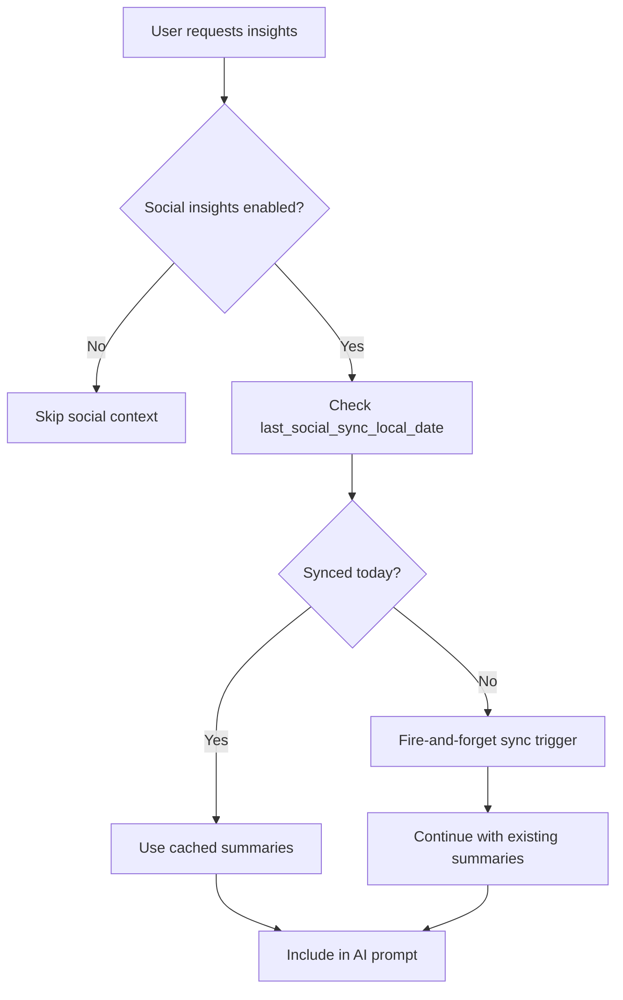
```mermaid
flowchart TD
    A[User requests insights] --> B{Social insights enabled?}
    B -->|No| C[Skip social context]
    B -->|Yes| D[Check last_social_sync_local_date]
    D --> E{Synced today?}
    E -->|Yes| F[Use cached summaries]
    E -->|No| G[Fire-and-forget sync trigger]
    G --> H[Continue with existing summaries]
    F --> I[Include in AI prompt]
    H --> I
```

---

## 5. Translation Flow

### 5.1 Server-Side Translation

```mermaid
flowchart TD
    A[User visits page] --> B[Server reads profile.language]
    B --> C[Load messages/{locale}.json]
    C --> D[NextIntlProvider wraps app]
    D --> E[Components call useTranslations]
    E --> F{Key exists?}
    F -->|Yes| G[Return translated string]
    F -->|No| H[Return key as fallback]
```

### 5.2 AI Response Translation

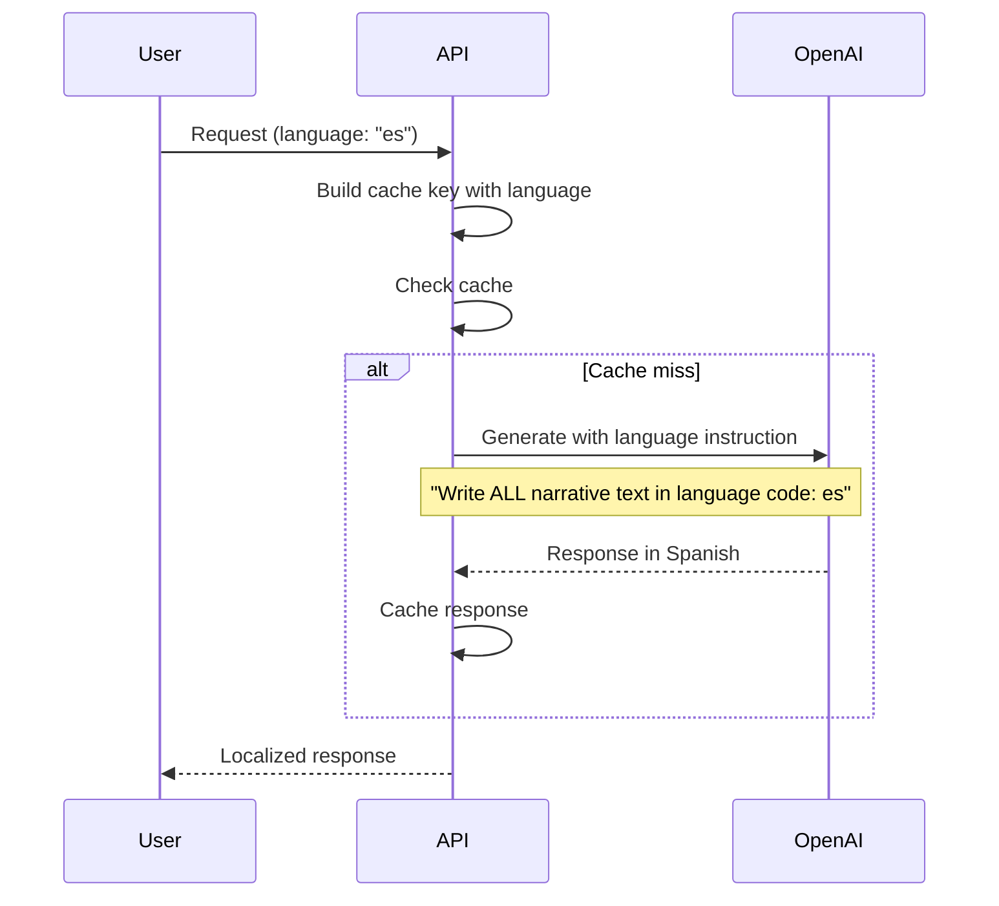
```mermaid
sequenceDiagram
    participant User
    participant API
    participant OpenAI

    User->>API: Request (language: "es")
    API->>API: Build cache key with language
    API->>API: Check cache

    alt Cache miss
        API->>OpenAI: Generate with language instruction
        Note over API,OpenAI: "Write ALL narrative text in language code: es"
        OpenAI-->>API: Response in Spanish
        API->>API: Cache response
    end

    API-->>User: Localized response
```

---

## 6. Numerology Flow

### 6.1 Core Number Calculation

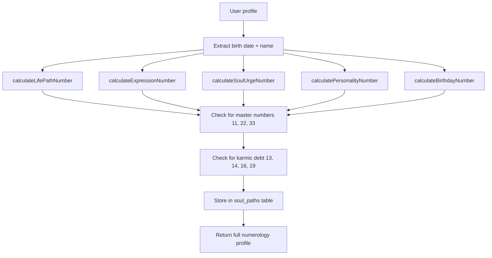
```mermaid
flowchart TD
    A[User profile] --> B[Extract birth date + name]

    B --> C[calculateLifePathNumber]
    B --> D[calculateExpressionNumber]
    B --> E[calculateSoulUrgeNumber]
    B --> F[calculatePersonalityNumber]
    B --> G[calculateBirthdayNumber]

    C --> H[Check for master numbers 11, 22, 33]
    D --> H
    E --> H
    F --> H
    G --> H

    H --> I[Check for karmic debt 13, 14, 16, 19]

    I --> J[Store in soul_paths table]
    J --> K[Return full numerology profile]
```

### 6.2 Personal Cycles

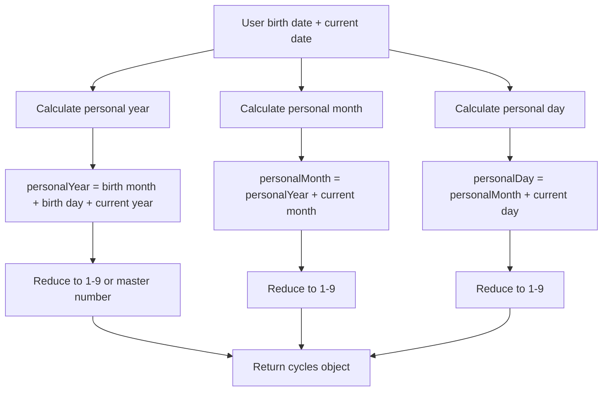
```mermaid
flowchart TD
    A[User birth date + current date] --> B[Calculate personal year]
    B --> C[personalYear = birth month + birth day + current year]
    C --> D[Reduce to 1-9 or master number]

    A --> E[Calculate personal month]
    E --> F[personalMonth = personalYear + current month]
    F --> G[Reduce to 1-9]

    A --> H[Calculate personal day]
    H --> I[personalDay = personalMonth + current day]
    I --> J[Reduce to 1-9]

    D --> K[Return cycles object]
    G --> K
    J --> K
```

---

## 7. Connection & Space Between Flow

### 7.1 Connection Brief (Daily)

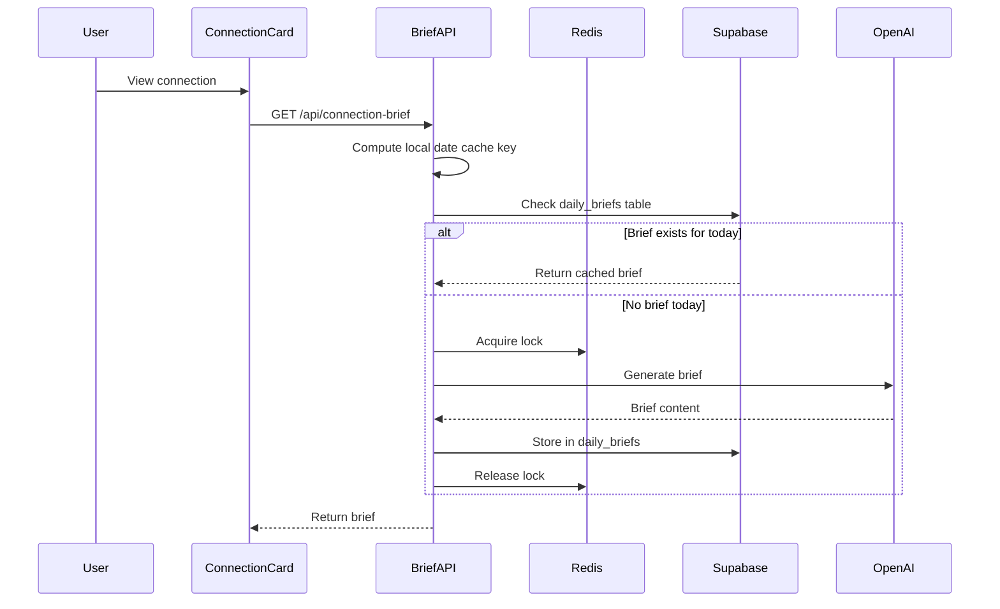
```mermaid
sequenceDiagram
    participant User
    participant ConnectionCard
    participant BriefAPI
    participant Redis
    participant Supabase
    participant OpenAI

    User->>ConnectionCard: View connection
    ConnectionCard->>BriefAPI: GET /api/connection-brief
    BriefAPI->>BriefAPI: Compute local date cache key
    BriefAPI->>Supabase: Check daily_briefs table

    alt Brief exists for today
        Supabase-->>BriefAPI: Return cached brief
    else No brief today
        BriefAPI->>Redis: Acquire lock
        BriefAPI->>OpenAI: Generate brief
        OpenAI-->>BriefAPI: Brief content
        BriefAPI->>Supabase: Store in daily_briefs
        BriefAPI->>Redis: Release lock
    end

    BriefAPI-->>ConnectionCard: Return brief
```

### 7.2 Space Between (Stone Tablet)

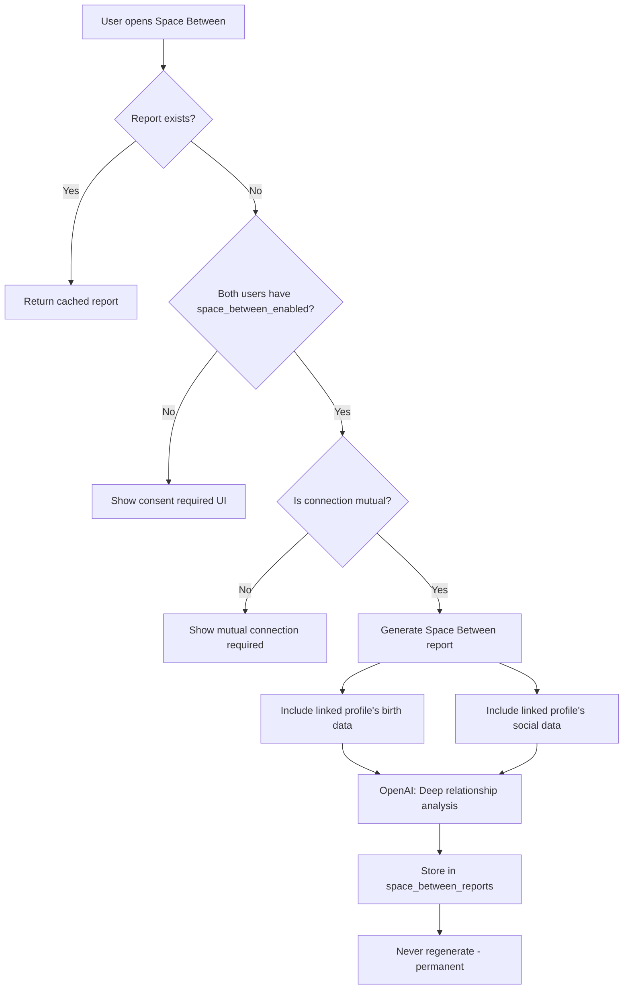
```mermaid
flowchart TD
    A[User opens Space Between] --> B{Report exists?}
    B -->|Yes| C[Return cached report]
    B -->|No| D{Both users have space_between_enabled?}
    D -->|No| E[Show consent required UI]
    D -->|Yes| F{Is connection mutual?}
    F -->|No| G[Show mutual connection required]
    F -->|Yes| H[Generate Space Between report]
    H --> I[Include linked profile's birth data]
    H --> J[Include linked profile's social data]
    I --> K[OpenAI: Deep relationship analysis]
    J --> K
    K --> L[Store in space_between_reports]
    L --> M[Never regenerate - permanent]
```

---

## 8. Error Handling Flow

### 8.1 Standardized API Error Response

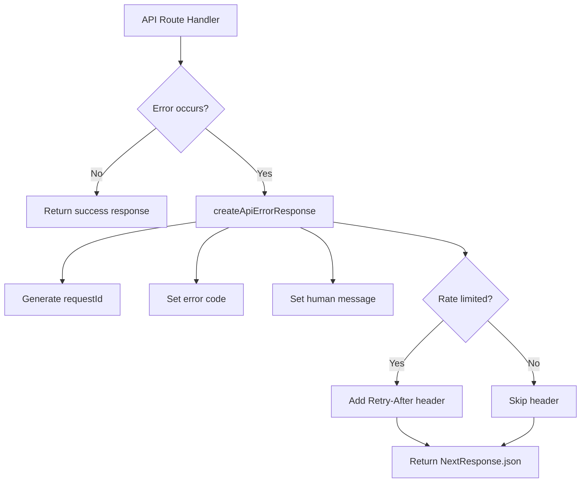
```mermaid
flowchart TD
    A[API Route Handler] --> B{Error occurs?}
    B -->|No| C[Return success response]
    B -->|Yes| D[createApiErrorResponse]
    D --> E[Generate requestId]
    D --> F[Set error code]
    D --> G[Set human message]
    D --> H{Rate limited?}
    H -->|Yes| I[Add Retry-After header]
    H -->|No| J[Skip header]
    I --> K[Return NextResponse.json]
    J --> K
```

### 8.2 Redis Failure Handling

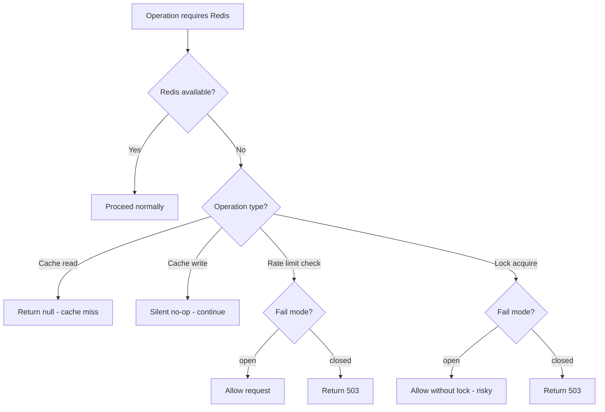
```mermaid
flowchart TD
    A[Operation requires Redis] --> B{Redis available?}
    B -->|Yes| C[Proceed normally]
    B -->|No| D{Operation type?}

    D -->|Cache read| E[Return null - cache miss]
    D -->|Cache write| F[Silent no-op - continue]
    D -->|Rate limit check| G{Fail mode?}
    D -->|Lock acquire| H{Fail mode?}

    G -->|open| I[Allow request]
    G -->|closed| J[Return 503]

    H -->|open| K[Allow without lock - risky]
    H -->|closed| L[Return 503]
```

---

## 9. Cron Job Flows

### 9.1 Insight Pre-warming

```mermaid
sequenceDiagram
    participant Cron
    participant PrewarmAPI
    participant Supabase
    participant InsightsAPI

    Cron->>PrewarmAPI: POST /api/cron/prewarm-insights
    PrewarmAPI->>PrewarmAPI: Verify CRON_SECRET
    PrewarmAPI->>Supabase: Get active users

    loop For each user (batched)
        PrewarmAPI->>InsightsAPI: Generate today's insight
        Note over PrewarmAPI: Uses internal call, not HTTP
    end

    PrewarmAPI-->>Cron: Report: X insights generated
```

### 9.2 Global Astrology Events Generation

```mermaid
sequenceDiagram
    participant Cron
    participant EventsAPI
    participant OpenAI
    participant Supabase

    Cron->>EventsAPI: POST /api/cron/generate-global-events
    EventsAPI->>Supabase: Check existing events for year

    alt Events exist
        EventsAPI-->>Cron: Skip - already generated
    else No events
        EventsAPI->>OpenAI: Generate yearly astrological events
        OpenAI-->>EventsAPI: Major transits, retrogrades, eclipses
        EventsAPI->>Supabase: Store in global_astrology_events
        EventsAPI-->>Cron: Success
    end
```

---

*Data flow documentation for Solara Insights*
