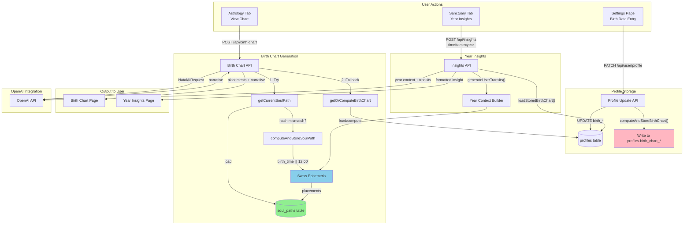

# Astrology Tab & Birth Chart System Forensic Audit

**Date:** January 25, 2026
**Type:** READ-ONLY forensic audit
**Purpose:** Expose reality before touching critical astrology infrastructure

---

## A) ASTROLOGY TAB AUDIT (UI → API → DATA)

### 1. UI ENTRY POINTS

#### Primary Astrology Tab Location
**File:** [app/(protected)/sanctuary/birth-chart/page.tsx](app/(protected)/sanctuary/birth-chart/page.tsx)

This is the ONLY "astrology" page. It shows:
- User's natal chart (planets, houses, angles)
- Soul Path narrative (AI-generated interpretation)
- Tab deep dives (optional expanded sections)

**NOT PRESENT:**
- "Explore" / other people's charts feature
- Chart generation for non-users
- Chart comparison view
- Precision level selector

#### Navigation Entry Point
**File:** [components/sanctuary/SanctuaryTabs.tsx](components/sanctuary/SanctuaryTabs.tsx)

```typescript
// Line 50-54: Astrology tab definition
{
  id: "astrology",
  label: "Astrology",
  href: "/sanctuary/birth-chart",
}
```

#### UI States Supported

| State | UI Behavior | Code Location |
|-------|-------------|---------------|
| No birth data | Shows error message | birth-chart/page.tsx:90-98 |
| Incomplete profile | "Please complete your birth signature" | birth-chart/page.tsx:97 |
| Valid profile | Shows chart + narrative | birth-chart/page.tsx:100+ |
| Loading | Skeleton loaders | birth-chart/page.tsx |

**FINDING:** There is NO "Core" vs "Full" precision UI. The system has ONE mode.

### 2. ACTIONS SUPPORTED

| Action | Supported? | Notes |
|--------|------------|-------|
| Generate "My" chart | YES | Automatically on page load |
| Generate another person's chart | NO | Not in astrology tab |
| Re-generate existing chart | PARTIAL | Only if birth data changes |
| Save a generated chart | AUTO | Stone tablet - saved once |
| Retrieve previous chart | YES | From soul_paths table |
| Switch between charts | NO | Only user's own chart |

#### "Other People's Charts" Feature

"Other people's charts" exists ONLY in the **Connections** feature, NOT in the Astrology tab.

**File:** [app/(protected)/sanctuary/connections/page.tsx](app/(protected)/sanctuary/connections/page.tsx)

Connections system allows:
- Adding people with name + relationship type
- Optional: birth date, birth time, birth location
- "Space Between" deep reports (requires mutual linking)

**File:** [app/api/connection-space-between/route.ts](app/api/connection-space-between/route.ts)

This route:
- Uses connection's birth data (if available)
- Passes to OpenAI for compatibility reports
- Does NOT compute Swiss Ephemeris charts for connections
- Just uses raw date/time strings in prompts

---

## B) BIRTH DATA & PRECISION MODEL AUDIT

### Current Data Model

**Profiles Table:**
| Column | Type | Required | Notes |
|--------|------|----------|-------|
| birth_date | TEXT | YES | "YYYY-MM-DD" |
| birth_time | TEXT | NO | "HH:MM" or NULL |
| birth_lat | DOUBLE | YES for chart | Latitude |
| birth_lon | DOUBLE | YES for chart | Longitude |
| timezone | TEXT | YES for chart | IANA timezone |
| birth_city | TEXT | NO | Display only |
| birth_region | TEXT | NO | Display only |
| birth_country | TEXT | NO | Display only |

### PRECISION LEVELS - WHAT THE CODE ACTUALLY DOES

**FINDING: There is NO explicit "Core vs Full" precision model in the code.**

Instead, the system has implicit behavior:

| Input State | What Happens | Precision Effect |
|-------------|--------------|------------------|
| birth_date + birth_time + location | Full chart computed | Houses accurate |
| birth_date + location (no time) | Noon default applied | Houses INACCURATE |
| birth_date only (no location) | BLOCKED | getCurrentSoulPath throws error |

### Silent Defaults

**File:** [lib/birthChart/storage.ts:68](lib/birthChart/storage.ts)
```typescript
const timeForSwiss = profile.birth_time || "12:00";
```

**File:** [lib/soulPath/storage.ts:184](lib/soulPath/storage.ts)
```typescript
const timeForSwiss = profile.birth_time || "12:00";
```

**CRITICAL FINDING:** Both storage systems silently default to noon (12:00) when birth time is NULL.

### Where Assumptions Break

| Location | Assumption | Reality |
|----------|------------|---------|
| `computeAndStoreBirthChart` | birth_lat required | Validated - throws error |
| `computeAndStoreBirthChart` | birth_time optional | Defaults to noon silently |
| `getCurrentSoulPath` | Full data required | Requires date + location + timezone |
| OpenAI payload | birth.time can be null | Houses still computed with noon |
| Birth Chart UI | Shows all houses | Doesn't indicate "approximate" |

### Connections Birth Data (Different Model)

**File:** [sql/014_connections_birth_coords.sql](sql/014_connections_birth_coords.sql)

Connections table has:
- `birth_date` (optional)
- `birth_time` (optional)
- `birth_lat`, `birth_lon` (optional)
- `timezone` (optional)

**FINDING:** Connection birth data is ALL OPTIONAL. No charts are computed for connections.

---

## C) BIRTH CHART GENERATION AUDIT (SWISS EPHEMERIS)

### 1. ENTRY POINTS

#### Natal Chart Computation

| Function | File | Purpose |
|----------|------|---------|
| `computeSwissPlacements()` | lib/ephemeris/swissEngine.ts:229 | Core computation |
| `computeAndStoreBirthChart()` | lib/birthChart/storage.ts:50 | Legacy storage path |
| `computeAndStoreSoulPath()` | lib/soulPath/storage.ts:171 | New storage path |
| `getCurrentSoulPath()` | lib/soulPath/storage.ts:252 | Main entry point |
| `getOrComputeBirthChart()` | lib/birthChart/storage.ts:208 | Legacy entry point |

#### Transit Computation

| Function | File | Purpose |
|----------|------|---------|
| `generateUserTransitsForYear()` | lib/ephemeris/solvers.ts:577 | User-specific transits |
| `generateGlobalEventsForYear()` | lib/ephemeris/solvers.ts:513 | Global events (cron) |
| `generateUserTransits()` | lib/insights/yearContext.ts:71 | Wrapper for insights |

### 2. INPUTS TO SWISS EPHEMERIS

**File:** [lib/ephemeris/swissEngine.ts:20-26](lib/ephemeris/swissEngine.ts)

```typescript
type SwissBirthInput = {
  date: string;      // "YYYY-MM-DD" - REQUIRED
  time: string;      // "HH:MM" - REQUIRED (defaulted to "12:00" upstream)
  timezone: string;  // IANA - REQUIRED
  lat: number;       // REQUIRED
  lon: number;       // REQUIRED
};
```

**FINDING:** swissEngine.ts expects ALL fields. Defaults are applied BEFORE this function is called.

### 3. OUTPUT STRUCTURE

**File:** [lib/ephemeris/swissEngine.ts:49-57](lib/ephemeris/swissEngine.ts)

```typescript
type SwissPlacements = {
  system: "western_tropical_placidus";
  planets: SwissPlanetPlacement[];    // 12 planets with sign, house, longitude
  houses: SwissHousePlacement[];       // 12 houses with cusp longitudes
  angles: SwissAngles;                 // Asc, MC, Desc, IC
  aspects?: AspectPlacement[];         // Major aspects
  derived?: DerivedSummary;            // Element/modality balance
  calculated?: CalculatedSummary;      // South Node, PoF, patterns
};
```

### 4. FAILURE MODES

**File:** [lib/ephemeris/swissEngine.ts:240](lib/ephemeris/swissEngine.ts)

```typescript
const ephePath = path.join(process.cwd(), "node_modules", "swisseph", "ephe");
swisseph.swe_set_ephe_path(ephePath);
```

| Failure Scenario | Behavior | User Impact |
|------------------|----------|-------------|
| ephe folder missing | swe_set_ephe_path accepts silently | Less accurate fallback |
| .se1 file missing | swe_calc_ut returns error | Planet omitted from chart |
| All files missing | All calculations fail | Empty/partial chart |
| Permission denied | System error | 500 response |

**FINDING:** Failures are SILENT. No startup validation.

---

## D) CHART STORAGE, DEDUPLICATION & RETRIEVAL

### 1. STORAGE LOCATIONS

#### Legacy Storage
**Table:** `profiles.birth_chart_placements_json`

```sql
-- sql/001_add_birth_chart_cache.sql
ALTER TABLE public.profiles
  ADD COLUMN IF NOT EXISTS birth_chart_placements_json JSONB;
  ADD COLUMN IF NOT EXISTS birth_chart_computed_at TIMESTAMPTZ;
```

#### New Storage
**Table:** `soul_paths`

```sql
-- sql/002_create_soul_paths_table.sql
CREATE TABLE public.soul_paths (
  user_id UUID PRIMARY KEY,
  schema_version INTEGER NOT NULL,
  computed_at TIMESTAMPTZ NOT NULL,
  birth_input_hash TEXT NOT NULL,
  soul_path_json JSONB NOT NULL
);
```

### 2. CHART IDENTIFICATION

**Deterministic Fingerprint:** YES - `birth_input_hash`

**File:** [lib/soulPath/storage.ts:65-83](lib/soulPath/storage.ts)

```typescript
export function computeBirthInputHash(profile: {
  birth_date: string | null;
  birth_time: string | null;
  birth_lat: number | null;
  birth_lon: number | null;
  timezone: string | null;
}): string {
  const input = [
    profile.birth_date || "",
    profile.birth_time || "",
    profile.birth_lat?.toString() || "",
    profile.birth_lon?.toString() || "",
    profile.timezone || "",
  ].join("");
  return createHash("sha256").update(input).digest("hex");
}
```

**FINDING:** Hash includes all 5 birth fields. Same inputs = same hash.

**NOT INCLUDED IN HASH:**
- House system (always Placidus)
- Zodiac mode (always Tropical)
- Ephemeris version (assumes swisseph package version)

### 3. DEDUPLICATION

**Same user, same inputs:** Chart reused (hash matches)
**Same user, different inputs:** New chart computed (hash mismatch)
**Different user, same inputs:** Each user gets their own copy

**FINDING:** No cross-user chart sharing. Each user has their own soul_paths row.

### 4. RETRIEVAL LOGIC

**File:** [lib/soulPath/storage.ts:252-282](lib/soulPath/storage.ts)

```typescript
export async function getCurrentSoulPath(userId, profile): Promise<SwissPlacements> {
  // 1. Validate required birth data
  // 2. Compute current birth input hash
  // 3. Try to load stored Soul Path
  // 4. If valid (schema + hash match), return it
  // 5. Otherwise compute fresh and store
}
```

**Validity Conditions:**
1. `schema_version >= SOUL_PATH_SCHEMA_VERSION` (currently 8)
2. `birth_input_hash === currentHash`

---

## E) DUAL STORAGE & DRIFT AUDIT (CRITICAL)

### Storage Systems Inventory

| Storage | Purpose | Active? |
|---------|---------|---------|
| `profiles.birth_chart_placements_json` | Legacy chart cache | YES (writes) |
| `profiles.birth_chart_computed_at` | Legacy timestamp | YES |
| `soul_paths.soul_path_json` | New chart storage | YES (primary) |
| `soul_paths.birth_input_hash` | Change detection | YES |
| `soul_paths.soul_path_narrative_json` | AI narrative cache | YES |
| `global_astrology_events` | Year tab events | YES |
| Redis cache | Insight caching | YES |

### READ/WRITE MATRIX

| Component | profiles.birth_chart_* | soul_paths | Action |
|-----------|------------------------|------------|--------|
| Profile Update API | WRITE | - | `computeAndStoreBirthChart()` |
| Birth Chart API (primary) | - | READ/WRITE | `getCurrentSoulPath()` |
| Birth Chart API (fallback) | READ/WRITE | - | `getOrComputeBirthChart()` |
| Insights API (year tab) | READ | - | `loadStoredBirthChart()` |
| Year Context Builder | READ | - | `loadStoredBirthChart()` |

### DRIFT SCENARIOS

```
┌─────────────────────────────────────────────────────────────────┐
│ SCENARIO 1: User updates birth data in Settings                 │
│                                                                 │
│ 1. Profile Update API called                                    │
│ 2. computeAndStoreBirthChart() → profiles table (LEGACY)        │
│ 3. soul_paths table NOT UPDATED                                 │
│ 4. User visits birth chart page                                 │
│ 5. getCurrentSoulPath() → reads soul_paths (STALE!)             │
│ 6. hash mismatch → triggers recompute → soul_paths updated      │
│                                                                 │
│ RESULT: Temporary drift until birth chart page visited          │
└─────────────────────────────────────────────────────────────────┘

┌─────────────────────────────────────────────────────────────────┐
│ SCENARIO 2: User views Year tab after Settings change           │
│                                                                 │
│ 1. Settings change → profiles updated                           │
│ 2. User views Year tab                                          │
│ 3. Insights API → loadStoredBirthChart() → profiles (NEW)       │
│ 4. soul_paths still has old data                                │
│                                                                 │
│ RESULT: Year tab uses NEW data, Birth Chart page uses OLD data  │
│         (until birth chart page triggers recompute)             │
└─────────────────────────────────────────────────────────────────┘
```

### SOURCE OF TRUTH ANALYSIS

| Data Type | De Facto Source | Authoritative? |
|-----------|-----------------|----------------|
| Birth inputs | profiles table | YES |
| Chart placements | AMBIGUOUS | Both may be valid/stale |
| AI narratives | soul_paths | YES (if exists) |
| Year insights | Redis cache | YES (cached) |

---

## F) DOWNSTREAM CONSUMERS

### Consumer Inventory

| Consumer | File | Data Expected | Precision Assumed |
|----------|------|---------------|-------------------|
| Birth Chart API | app/api/birth-chart/route.ts | SwissPlacements | Full (has houses) |
| Insights API (year) | app/api/insights/route.ts | SwissPlacements | Full |
| Year Context Builder | lib/insights/yearContext.ts | planets with longitude | Full |
| Space Between | app/api/connection-space-between/route.ts | Raw birth strings | None (uses strings only) |
| Daily Briefs | app/api/connection-daily-brief/route.ts | Raw birth strings | None |

### What Happens With Missing Data

| Consumer | Missing birth_time | Missing location |
|----------|-------------------|------------------|
| Birth Chart API | Noon default | ERROR (blocks) |
| Insights API (year) | Noon default in chart | ERROR (blocks) |
| Space Between | "unknown" in prompt | "unknown" in prompt |
| Daily Briefs | "unknown" in prompt | "unknown" in prompt |

### OpenAI Payload Injection Points

**Birth Chart API** (app/api/birth-chart/route.ts:819-863):
```typescript
const aiPayload: NatalAIRequest = {
  birth: {
    date: profile.birth_date,
    time: profile.birth_time,  // CAN BE NULL
    timezone: profile.timezone,
  },
  placements: {
    planets: [{ house: 10, ... }],  // SPECIFIC HOUSES (from noon!)
  }
};
```

**FINDING:** OpenAI sees `time: null` but `house: 10` - CONTRADICTION.

---

## G) CACHING & PERFORMANCE AUDIT

### Cache Layers

| Layer | Key Pattern | TTL | Location |
|-------|-------------|-----|----------|
| Soul Paths (DB) | `user_id` | Forever | soul_paths table |
| Legacy Charts (DB) | `user_id` | Forever | profiles table |
| AI Narratives (DB) | `user_id` | Until prompt version bumps | soul_paths.soul_path_narrative_json |
| Insights (Redis) | `insights:{userId}:{timeframe}:{periodKey}:{lang}:{promptVer}` | 2-400 days | Redis |
| Tab Deep Dives (DB) | `user_id` | Until version bumps | soul_paths table |

### Cache Invalidation Rules

| Cache | Invalidation Trigger |
|-------|---------------------|
| Soul Path placements | birth_input_hash mismatch |
| Soul Path placements | schema_version bump |
| AI narrative | birth_input_hash mismatch |
| AI narrative | prompt_version bump |
| AI narrative | language change |
| Insights | period key rollover (daily/weekly/etc) |

### Performance Risks

| Risk | Scenario | Impact |
|------|----------|--------|
| Unnecessary recompute | Profile update triggers new chart even if birth data unchanged | Wasted Swiss Ephemeris calls |
| User transits on-demand | Year tab computes transits on every request | ~50-100ms added latency |
| No cross-user sharing | Users with same birth data get duplicate computations | Storage bloat |

---

## H) TEST COVERAGE AUDIT

### Test Files Inventory

| File | Status | Coverage |
|------|--------|----------|
| `__tests__/api/birth-chart.test.ts` | **20 TODO stubs** | 0% |
| `__tests__/validation/birth-data.test.ts` | **20 TODO stubs** | 0% |
| `__tests__/api/insights.test.ts` | **TODO stubs** | 0% |
| `__tests__/ephemeris/*` | **DOES NOT EXIST** | 0% |

### Critical Untested Behaviors

| Behavior | Risk Level | Notes |
|----------|------------|-------|
| Noon default when birth_time null | P0 | Wrong houses displayed |
| Schema version cache invalidation | P0 | Stale data served |
| Dual storage fallback logic | P0 | Drift undetected |
| Birth input hash computation | P0 | Cache may not invalidate |
| High latitude house calculations | P1 | Placidus fails near poles |
| DST transition handling | P1 | Wrong times for ambiguous dates |
| Ephemeris file validation | P1 | Silent failures in production |

---

## I) END-TO-END FLOW DIAGRAM



### Data Shape at Key Points

```
┌─────────────────────────────────────────────────────────────────┐
│ USER INPUT (Settings)                                           │
│                                                                 │
│ {                                                               │
│   birth_date: "1990-05-15",                                     │
│   birth_time: null,           // OR "14:30"                     │
│   birth_lat: 40.7128,                                           │
│   birth_lon: -74.0060,                                          │
│   timezone: "America/New_York"                                  │
│ }                                                               │
└─────────────────────────────────────────────────────────────────┘
                              │
                              ▼
┌─────────────────────────────────────────────────────────────────┐
│ SWISS EPHEMERIS INPUT (after defaults)                          │
│                                                                 │
│ {                                                               │
│   date: "1990-05-15",                                           │
│   time: "12:00",              // DEFAULT APPLIED HERE           │
│   timezone: "America/New_York",                                 │
│   lat: 40.7128,                                                 │
│   lon: -74.0060                                                 │
│ }                                                               │
└─────────────────────────────────────────────────────────────────┘
                              │
                              ▼
┌─────────────────────────────────────────────────────────────────┐
│ SWISS EPHEMERIS OUTPUT (SwissPlacements)                        │
│                                                                 │
│ {                                                               │
│   system: "western_tropical_placidus",                          │
│   planets: [                                                    │
│     { name: "Sun", sign: "Taurus", house: 10, longitude: 54.2 } │
│   ],                                                            │
│   houses: [                                                     │
│     { house: 1, signOnCusp: "Leo", cuspLongitude: 121.5 }       │
│   ],                                                            │
│   angles: { ascendant: { sign: "Leo", longitude: 121.5 } },     │
│   aspects: [...],                                               │
│   derived: { elementBalance: {...}, dominantSigns: [...] },     │
│   calculated: { southNode: {...}, partOfFortune: {...} }        │
│ }                                                               │
│                                                                 │
│ ** NO FLAG: timeWasDefaulted: true **                           │
└─────────────────────────────────────────────────────────────────┘
                              │
                              ▼
┌─────────────────────────────────────────────────────────────────┐
│ OPENAI PAYLOAD (NatalAIRequest)                                 │
│                                                                 │
│ {                                                               │
│   birth: {                                                      │
│     date: "1990-05-15",                                         │
│     time: null,               // HONEST - time unknown          │
│     timezone: "America/New_York"                                │
│   },                                                            │
│   placements: {                                                 │
│     planets: [{ house: 10 }]  // SPECIFIC - computed from noon! │
│   }                                                             │
│ }                                                               │
│                                                                 │
│ ** CONTRADICTION: "time unknown" + "Sun in 10th house" **       │
└─────────────────────────────────────────────────────────────────┘
```

---

## J) CONCLUSIONS (NO FIXES)

### What The System ACTUALLY Does Today

1. **Single Chart Mode:** There is no "Core vs Full" precision model. The system computes ONE type of chart (full Placidus) regardless of input completeness.

2. **Silent Noon Default:** When birth time is NULL, the system silently defaults to 12:00 and computes SPECIFIC house placements as if that time were known.

3. **Dual Storage Active:** Both `profiles.birth_chart_placements_json` and `soul_paths.soul_path_json` are actively written and read by different code paths.

4. **Different Consumers Read Different Sources:**
   - Birth Chart API reads `soul_paths` (primary)
   - Insights API reads `profiles` (legacy)
   - Profile Update writes to `profiles` only

5. **No "Other Charts" in Astrology Tab:** The astrology tab shows ONLY the user's own chart. "Other people's charts" exist only in the Connections feature, which does NOT compute ephemeris-based charts.

6. **Connections Use Raw Strings:** Space Between and Daily Briefs pass birth data as raw strings to OpenAI - no Swiss Ephemeris computation for connections.

7. **Zero Test Coverage:** All 40+ birth chart / ephemeris tests are TODO stubs with no implementations.

### Where Assumptions Conflict With Intent

| Assumption | Reality |
|------------|---------|
| "Core charts don't have houses" | ALL charts have houses (computed from noon) |
| "Precision levels exist" | No precision concept in code |
| "Users can explore other charts" | Only in Connections, not Astrology tab |
| "Charts are shared across users" | Each user has their own copy |
| "Missing time is handled gracefully" | Noon default applied silently |

### Where We Are At Risk Touching Code

1. **Dual storage writes:** Changing write paths could cause worse drift
2. **Schema version bumps:** Would invalidate ALL cached charts globally
3. **Hash computation:** Changing hash breaks all existing caches
4. **Swiss Ephemeris path:** Environment-specific, no validation
5. **Noon default logic:** Two files have identical logic - must change both

### What MUST Be Understood Before Editing

1. **The noon default is deliberate** - It allows chart generation when time is unknown
2. **Dual storage exists because of migration** - soul_paths is "new", profiles is "legacy"
3. **Connections don't use ephemeris** - They use raw strings for OpenAI only
4. **No precision flags exist** - Adding them requires schema changes + backfill
5. **Tests are completely absent** - Any change could break without detection

---

**END OF FORENSIC AUDIT**

*This document exposes current system behavior. No fixes are proposed.*
