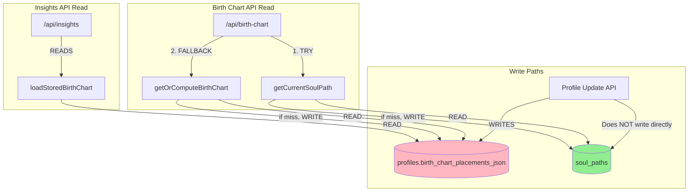
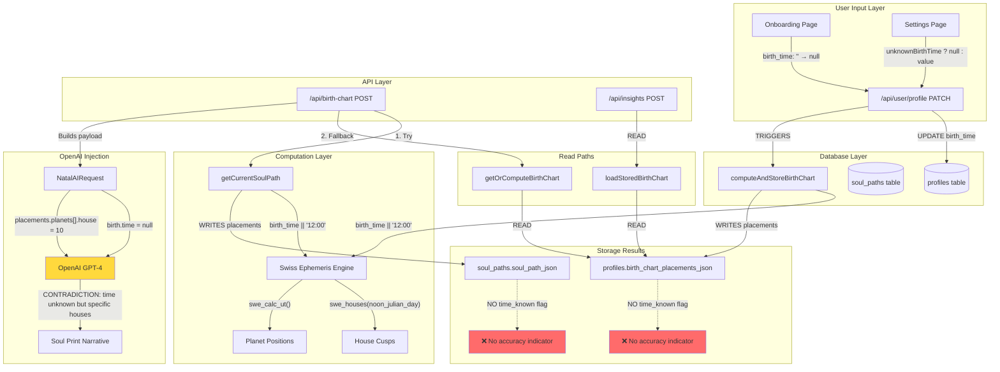

# Birth Time & Storage Forensic Audit

**Date:** January 25, 2026
**Type:** READ-ONLY forensic audit
**Purpose:** Expose reality for careful decision-making

---

## A) BIRTH TIME TRUTH AUDIT

### 1. INPUT SURFACE

#### Onboarding Entry Point
**File:** [app/(auth)/onboarding/page.tsx](app/(auth)/onboarding/page.tsx)

```
Line 31: const [birthTime, setBirthTime] = useState("");
Line 88: setBirthTime(profile.birth_time || "");
Line 205: birth_time: birthTime || null,
```

**Behavior:**
- State initialized to empty string `""`
- Loaded from profile as `profile.birth_time || ""` (null → empty string)
- Sent to API as `birthTime || null` (empty string → null)

#### Settings Entry Point
**File:** [app/(protected)/settings/page.tsx](app/(protected)/settings/page.tsx)

```
Line 84-85: const [birthTime, setBirthTime] = useState("");
           const [unknownBirthTime, setUnknownBirthTime] = useState(false);
Line 269-270: setBirthTime(profile.birth_time || "");
              setUnknownBirthTime(!profile.birth_time);
Line 469: birth_time: unknownBirthTime ? null : birthTime || null,
```

**Behavior:**
- Has an `unknownBirthTime` checkbox/toggle
- If unknown: sends `null`
- If known but empty: sends `null`
- If known with value: sends the value

#### EXACT PAYLOAD WHEN BIRTH TIME IS SKIPPED

| Scenario | UI State | Payload Sent |
|----------|----------|--------------|
| User leaves time blank | `birthTime = ""` | `birth_time: null` |
| User checks "unknown" | `unknownBirthTime = true` | `birth_time: null` |
| User enters "12:00" | `birthTime = "12:00"` | `birth_time: "12:00"` |

**FINDING:** No way to distinguish "unknown" from "empty input" - both become `null`.

---

### 2. WRITE PATH

#### API Route Handler
**File:** [app/api/user/profile/route.ts](app/api/user/profile/route.ts)

```typescript
// Line 203-208: Direct update to profiles table
const { data: updatedProfile, error: updateError } = await supabase
  .from("profiles")
  .update(updates)  // includes birth_time as-is (null or string)
  .eq("id", user.id)
  .select()
  .single();
```

**Then triggers birth chart computation:**
```typescript
// Lines 228-234
await computeAndStoreBirthChart(user.id, {
  birth_date: updatedProfile.birth_date,
  birth_time: updatedProfile.birth_time,  // CAN BE NULL
  birth_lat: updatedProfile.birth_lat,
  birth_lon: updatedProfile.birth_lon,
  timezone: updatedProfile.timezone,
});
```

#### Legacy Storage Write
**File:** [lib/birthChart/storage.ts](lib/birthChart/storage.ts)

```typescript
// Lines 67-68 - SILENT DEFAULT TO NOON
const timeForSwiss = profile.birth_time || "12:00";

// Lines 85-94 - Writes to profiles table
const { error } = await supabase
  .from("profiles")
  .update({
    birth_chart_placements_json: {
      schemaVersion: BIRTH_CHART_SCHEMA_VERSION,
      ...placements,  // NO FLAG indicating time was defaulted
    },
    birth_chart_computed_at: computedAt,
  })
  .eq("id", userId);
```

#### New Storage Write
**File:** [lib/soulPath/storage.ts](lib/soulPath/storage.ts)

```typescript
// Lines 183-184 - SAME SILENT DEFAULT TO NOON
const timeForSwiss = profile.birth_time || "12:00";

// Lines 204-217 - Writes to soul_paths table
const { error } = await supabase
  .from("soul_paths")
  .upsert({
    user_id: userId,
    schema_version: SOUL_PATH_SCHEMA_VERSION,
    computed_at: computedAt,
    birth_input_hash: birthInputHash,  // Hash includes null birth_time
    soul_path_json: placements,  // NO FLAG indicating time was defaulted
  }, { onConflict: "user_id" });
```

#### Birth Input Hash Calculation
**File:** [lib/soulPath/storage.ts:65-83](lib/soulPath/storage.ts)

```typescript
export function computeBirthInputHash(profile: {
  birth_date: string | null;
  birth_time: string | null;  // null → ""
  // ...
}): string {
  const input = [
    profile.birth_date || "",
    profile.birth_time || "",  // null becomes empty string
    // ...
  ].join("");
  return createHash("sha256").update(input).digest("hex");
}
```

**FINDING:** Hash distinguishes `"12:00"` from `null` (good), but no downstream consumer knows which is which.

---

### 3. READ PATH

#### Birth Chart API Read
**File:** [app/api/birth-chart/route.ts](app/api/birth-chart/route.ts)

```typescript
// Lines 614-624 - Primary read path
let swissPlacements;
try {
  swissPlacements = await getCurrentSoulPath(user.id, profile);
} catch (soulPathError: any) {
  // Fallback to legacy storage
  swissPlacements = await getOrComputeBirthChart(user.id, profile);
}
```

**OpenAI Payload Construction (Lines 819-863):**
```typescript
const aiPayload: NatalAIRequest = {
  // ...
  birth: {
    date: profile.birth_date,
    time: profile.birth_time,  // PASSES NULL TO OPENAI
    timezone: profile.timezone,
    // ...
  },
  placements: {
    // ... planets WITH HOUSE NUMBERS (computed using noon default!)
  }
};
```

**CRITICAL MISMATCH:**
- `birth.time` = `null` (honest about unknown time)
- `placements.planets[].house` = real numbers (computed using 12:00)
- OpenAI sees: "time is unknown" + "Sun is in 10th house"
- This is CONTRADICTORY - houses require known time

#### System Prompt Awareness
**File:** [app/api/birth-chart/route.ts:511-512](app/api/birth-chart/route.ts)

```
// Line 511-512 in SOUL_PATH_SYSTEM_PROMPT:
"- If birth time is null/approximate, gently note house themes are approximate"
```

**FINDING:** Prompt TELLS OpenAI to note approximate houses, but gives it SPECIFIC house numbers. No actual flag saying "these houses were computed from noon default."

#### Insights API Read Path
**File:** [lib/insights/yearContext.ts](lib/insights/yearContext.ts)

- Uses `loadStoredBirthChart()` which reads from `profiles.birth_chart_placements_json`
- No check for birth time accuracy
- Transits computed using the noon-defaulted placements

---

### 4. CONFIDENCE / ACCURACY FLAGS

#### Current State: **NO FLAGS EXIST**

| Table | Column | Purpose | Exists? |
|-------|--------|---------|---------|
| `profiles` | `birth_time` | Actual birth time | YES (nullable) |
| `profiles` | `birth_time_known` | Flag for known vs unknown | **NO** |
| `profiles` | `birth_time_accuracy` | Precision indicator | **NO** |
| `soul_paths` | `birth_time_approximate` | Flag in placements | **NO** |
| `soul_paths.soul_path_json` | `timeKnown` | Flag in JSON | **NO** |

**FINDING:** The ONLY way to detect "unknown birth time" is to check if `profile.birth_time IS NULL`. But the computed placements don't carry this information forward.

---

### BIRTH TIME TRUTH TABLE

| Input State | DB Value | Swiss Ephemeris Input | Houses Computed? | Flag? | OpenAI Sees |
|-------------|----------|----------------------|------------------|-------|-------------|
| User enters "14:30" | `"14:30"` | `"14:30"` | YES (accurate) | NO | time="14:30", houses=accurate |
| User enters "12:00" | `"12:00"` | `"12:00"` | YES (accurate) | NO | time="12:00", houses=accurate |
| User leaves blank | `null` | `"12:00"` (defaulted!) | YES (INACCURATE) | **NO** | time=null, houses=INACCURATE |
| User checks "unknown" | `null` | `"12:00"` (defaulted!) | YES (INACCURATE) | **NO** | time=null, houses=INACCURATE |

**THE CORE PROBLEM:** When birth time is unknown, the system:
1. Correctly stores `null` in the database
2. Silently defaults to `"12:00"` for computation
3. Computes SPECIFIC house placements using that default
4. Passes those house placements to OpenAI WITHOUT any flag
5. OpenAI sees "time unknown" but "Sun in 10th house" - CONTRADICTION

---

## B) DUAL STORAGE SYSTEM AUDIT

### 1. LEGACY STORAGE

**Location:** `profiles.birth_chart_placements_json`

**Schema:** [sql/001_add_birth_chart_cache.sql](sql/001_add_birth_chart_cache.sql)
```sql
ALTER TABLE public.profiles
  ADD COLUMN IF NOT EXISTS birth_chart_placements_json JSONB;
  ADD COLUMN IF NOT EXISTS birth_chart_computed_at TIMESTAMPTZ;
```

**What Writes:**
- [lib/birthChart/storage.ts:computeAndStoreBirthChart()](lib/birthChart/storage.ts) - Lines 85-94

**What Reads:**
- [lib/birthChart/storage.ts:loadStoredBirthChart()](lib/birthChart/storage.ts) - Lines 116-151
- [lib/birthChart/storage.ts:getOrComputeBirthChart()](lib/birthChart/storage.ts) - Lines 208-230
- [app/api/birth-chart/route.ts](app/api/birth-chart/route.ts) - Line 622 (fallback only)

**Still Updated?** YES - via `computeAndStoreBirthChart()` called from profile update

**Authoritative?** NO - only used as fallback

### 2. NEW STORAGE

**Location:** `soul_paths` table

**Schema:** [sql/002_create_soul_paths_table.sql](sql/002_create_soul_paths_table.sql)
```sql
CREATE TABLE IF NOT EXISTS public.soul_paths (
  user_id UUID PRIMARY KEY REFERENCES auth.users(id) ON DELETE CASCADE,
  schema_version INTEGER NOT NULL,
  computed_at TIMESTAMPTZ NOT NULL DEFAULT NOW(),
  birth_input_hash TEXT NOT NULL,
  soul_path_json JSONB NOT NULL
);
```

**What Writes:**
- [lib/soulPath/storage.ts:computeAndStoreSoulPath()](lib/soulPath/storage.ts) - Lines 171-231

**What Reads:**
- [lib/soulPath/storage.ts:getCurrentSoulPath()](lib/soulPath/storage.ts) - Lines 252-282
- [app/api/birth-chart/route.ts](app/api/birth-chart/route.ts) - Line 615 (primary)

**Complete for All Users?** NO - only users who've visited birth chart page since migration

### 3. DRIFT ANALYSIS



#### IDENTIFIED DRIFT SCENARIOS

| Scenario | Writes To | Reads From | Data Consistent? |
|----------|-----------|------------|------------------|
| User updates birth data in Settings | `profiles` only (via computeAndStoreBirthChart) | `soul_paths` first | **NO** - soul_paths has stale data |
| User visits birth chart page | `soul_paths` | `soul_paths` | YES |
| User views Year tab insights | N/A | `profiles` (via loadStoredBirthChart) | Maybe stale |
| New user completes onboarding | `profiles` only | `soul_paths` (empty) → fallback to `profiles` | YES (fallback works) |

#### RACE CONDITION

**File:** [app/api/user/profile/route.ts:228-234](app/api/user/profile/route.ts)

```typescript
// This writes to LEGACY storage only
await computeAndStoreBirthChart(user.id, { ... });
```

Then on next birth chart page visit:
```typescript
// This reads from NEW storage first
swissPlacements = await getCurrentSoulPath(user.id, profile);
```

**Result:** `soul_paths` may have OLD data while `profiles.birth_chart_placements_json` has NEW data.

### STORAGE DIAGRAM

```
┌─────────────────────────────────────────────────────────────────┐
│                    PROFILE UPDATE FLOW                          │
│                                                                 │
│  Settings Page → /api/user/profile → profiles table             │
│                         │                                       │
│                         ▼                                       │
│            computeAndStoreBirthChart()                          │
│                         │                                       │
│                         ▼                                       │
│         profiles.birth_chart_placements_json  ← WRITTEN         │
│                                                                 │
│         soul_paths.soul_path_json             ← NOT WRITTEN!    │
└─────────────────────────────────────────────────────────────────┘

┌─────────────────────────────────────────────────────────────────┐
│                    BIRTH CHART READ FLOW                        │
│                                                                 │
│  /api/birth-chart                                               │
│         │                                                       │
│         ▼                                                       │
│  getCurrentSoulPath() → soul_paths table (PRIMARY)              │
│         │                                                       │
│         ├─ HIT → return (may be STALE!)                         │
│         │                                                       │
│         └─ MISS → compute & store → soul_paths                  │
│                   │                                             │
│                   └─ FALLBACK: getOrComputeBirthChart()         │
│                                → profiles table                 │
└─────────────────────────────────────────────────────────────────┘

┌─────────────────────────────────────────────────────────────────┐
│                    INSIGHTS READ FLOW                           │
│                                                                 │
│  /api/insights (year tab)                                       │
│         │                                                       │
│         ▼                                                       │
│  loadStoredBirthChart() → profiles.birth_chart_placements_json  │
│                                                                 │
│  (Does NOT use soul_paths at all!)                              │
└─────────────────────────────────────────────────────────────────┘
```

**DE FACTO SOURCES OF TRUTH:**
- Birth data input: `profiles` table (authoritative)
- Birth chart placements: **AMBIGUOUS** - both systems may have different data
- Year insights: `profiles.birth_chart_placements_json` (may not match what birth chart page shows)

---

## C) TEST COVERAGE GAP AUDIT

### Test Files Inventory

| Test File | Intended Coverage | Current Status | Risk Introduced |
|-----------|------------------|----------------|-----------------|
| `__tests__/api/birth-chart.test.ts` | Birth chart API, caching, validation | **20 TODO stubs, 0 implementations** | Cannot detect regression in chart computation |
| `__tests__/validation/birth-data.test.ts` | Birth data validation | **20 TODO stubs, 0 implementations** | Invalid data may reach ephemeris |
| `__tests__/ephemeris/*` | Core ephemeris calculations | **DOES NOT EXIST** | Math errors go undetected |
| `__tests__/api/insights.test.ts` | Insights API | **14 TODO stubs, 0 implementations** | Year context generation untested |

### Specific Untested Behaviors

| Behavior | Location | Test Status | Production Risk |
|----------|----------|-------------|-----------------|
| Noon default when birth_time is null | `lib/birthChart/storage.ts:68` | UNTESTED | Wrong houses displayed without warning |
| Birth input hash computation | `lib/soulPath/storage.ts:65-83` | UNTESTED | Cache may not invalidate correctly |
| Schema version cache invalidation | Both storage files | UNTESTED | Old schema data may be served |
| Dual storage fallback logic | `app/api/birth-chart/route.ts:614-624` | UNTESTED | Fallback may serve stale data |
| UTC timezone rejection | `app/api/birth-chart/route.ts:582-596` | UNTESTED | Invalid timezone may slip through |
| House calculation at high latitudes | `lib/ephemeris/swissEngine.ts` | UNTESTED | Placidus fails near poles |
| DST transition handling | `lib/ephemeris/swissEngine.ts:125-193` | UNTESTED | Wrong positions for ambiguous times |

### Tests That Reference Birth Time

```
__tests__/validation/birth-data.test.ts:48:    test.todo("accepts null birth_time (defaults to noon)");
__tests__/api/birth-chart.test.ts:34:    test.todo("hash handles null birth_time");
__tests__/api/birth-chart.test.ts:52:    test.todo("uses noon as default when birth_time missing");
```

**FINDING:** All birth time related tests are TODO stubs with zero implementations.

---

## D) SWISS EPHEMERIS FILE SAFETY AUDIT

### 1. LOCATION

**Expected Path:**
```typescript
// lib/ephemeris/swissEngine.ts:240
const ephePath = path.join(process.cwd(), "node_modules", "swisseph", "ephe");
swisseph.swe_set_ephe_path(ephePath);
```

**Duplicated In:**
```typescript
// lib/ephemeris/solvers.ts - Lines 278, 417, 511, 616, 666
const ephePath = path.join(process.cwd(), "node_modules", "swisseph", "ephe");
swisseph.swe_set_ephe_path(ephePath);
```

**FINDING:** Path is set 6 times across 2 files with same hardcoded value.

### 2. VALIDATION

| Check | Implemented? | Location |
|-------|--------------|----------|
| Directory exists | NO | - |
| Required files present | NO | - |
| Permission to read | NO | - |
| Error handling for missing files | NO (silent fail) | - |

**What Happens If Files Missing:**
```typescript
// swisseph.swe_calc_ut() returns error code in result.error
// But error handling is:
if (result.error) {
  console.error(`Failed to calculate position for planet ${planetId}:`, result.error);
  continue;  // SILENT SKIP - planet just omitted from results
}
```

**FINDING:** Missing ephemeris files cause planets to be silently omitted from results.

### 3. DEPLOYMENT RISKS

| Environment | Path Resolution | Risk Level |
|-------------|-----------------|------------|
| Local dev | `process.cwd()` = project root | LOW |
| Vercel (Next.js) | `process.cwd()` may differ | MEDIUM |
| Docker | Requires volume mount | HIGH |
| Serverless cold start | node_modules may be pruned | HIGH |

**Potential Failure Modes:**

1. **Serverless cold start:**
   - Large node_modules may be pruned
   - `ephe` folder may be missing
   - Result: Silent computation failure

2. **Docker without volume mount:**
   - Container rebuilds may lose ephe data
   - Path inside container differs
   - Result: All calculations fail

3. **Build step pruning:**
   - Production builds may tree-shake unused files
   - `ephe/*.se1` files not in import graph
   - Result: Files missing in production

### Failure Behavior

| Scenario | Behavior | User Impact |
|----------|----------|-------------|
| `ephe` folder missing | `swe_set_ephe_path` silently accepts | Calculations use fallback (less accurate) |
| Specific `.se1` file missing | `swe_calc_ut` returns error | Planet omitted from chart |
| All files missing | All planet calculations fail | Empty chart returned |
| Permission denied | System error | 500 response |

**FINDING:** Failures are SILENT. No startup validation, no health check, no alerts.

---

## E) END-TO-END FLOW MAP



### Data Shape at Each Step

```
┌─────────────────────────────────────────────────────────────────┐
│ STEP 1: User Input                                              │
│                                                                 │
│ Onboarding: { birth_time: "" } → { birth_time: null }          │
│ Settings:   { unknownBirthTime: true } → { birth_time: null }  │
│ Settings:   { birth_time: "14:30" } → { birth_time: "14:30" }  │
└─────────────────────────────────────────────────────────────────┘
                              │
                              ▼
┌─────────────────────────────────────────────────────────────────┐
│ STEP 2: Database Storage                                        │
│                                                                 │
│ profiles.birth_time = null | "14:30"                           │
│                                                                 │
│ ** DEFAULT APPLIED HERE - NOT STORED **                        │
└─────────────────────────────────────────────────────────────────┘
                              │
                              ▼
┌─────────────────────────────────────────────────────────────────┐
│ STEP 3: Swiss Ephemeris Computation                             │
│                                                                 │
│ const timeForSwiss = profile.birth_time || "12:00";            │
│                                                                 │
│ Input: { date: "1990-05-15", time: "12:00", lat, lon, tz }     │
│ Output: {                                                       │
│   planets: [{ name: "Sun", sign: "Taurus", house: 10, ... }],  │
│   houses: [{ house: 1, signOnCusp: "Leo", ... }],              │
│   angles: { ascendant: { sign: "Leo" }, ... }                  │
│   // ** NO FLAG: time_was_defaulted: true **                   │
│ }                                                               │
└─────────────────────────────────────────────────────────────────┘
                              │
                              ▼
┌─────────────────────────────────────────────────────────────────┐
│ STEP 4: Cached Placements                                       │
│                                                                 │
│ soul_paths.soul_path_json = {                                  │
│   system: "western_tropical_placidus",                         │
│   planets: [{ house: 10, ... }],  // SPECIFIC NUMBER           │
│   houses: [...],                   // ALL 12 HOUSES            │
│   angles: { ascendant: "Leo" }     // SPECIFIC SIGN            │
│   // ** NO: timeKnown: false **                                │
│ }                                                               │
└─────────────────────────────────────────────────────────────────┘
                              │
                              ▼
┌─────────────────────────────────────────────────────────────────┐
│ STEP 5: OpenAI Payload                                          │
│                                                                 │
│ NatalAIRequest = {                                              │
│   birth: {                                                      │
│     time: null,          // ← HONEST: time unknown             │
│   },                                                            │
│   placements: {                                                 │
│     planets: [{                                                 │
│       name: "Sun",                                              │
│       house: 10,         // ← SPECIFIC: computed from noon     │
│     }],                                                         │
│   }                                                             │
│ }                                                               │
│                                                                 │
│ ** CONTRADICTION: "time is unknown" + "Sun is in 10th house" **│
└─────────────────────────────────────────────────────────────────┘
```

---

## F) CONCLUSIONS (NO FIXES)

### What Is ACTUALLY Happening Today

1. **Birth time unknown → noon default:**
   - User skips birth time or checks "unknown"
   - Database stores `birth_time = null`
   - Ephemeris computes with `"12:00"` as silent default
   - Houses and angles are computed for noon
   - Placements stored WITHOUT any accuracy flag

2. **Dual storage systems are ACTIVE and INCONSISTENT:**
   - Profile updates write to `profiles.birth_chart_placements_json`
   - Birth chart API reads from `soul_paths` first
   - Insights API reads from `profiles` only
   - User may see different data on different pages

3. **OpenAI receives contradictory information:**
   - `birth.time = null` (admits time is unknown)
   - `placements.planets[].house = specific number` (implies time is known)
   - Prompt says "note if approximate" but gives specific house numbers

4. **Zero test coverage on all birth time paths:**
   - All 40+ related tests are TODO stubs
   - No protection against regressions
   - Noon default behavior completely untested

5. **Swiss Ephemeris files have no validation:**
   - Path assumed to exist
   - No startup check
   - Silent failure mode (planets omitted)

### Where Truth Is Ambiguous or Duplicated

| Data | Location 1 | Location 2 | Consistent? |
|------|-----------|-----------|-------------|
| Birth time raw value | `profiles.birth_time` | N/A | Single source (good) |
| Birth chart placements | `profiles.birth_chart_placements_json` | `soul_paths.soul_path_json` | **NO** - can drift |
| Time known vs unknown | `profiles.birth_time IS NULL` | nowhere else | Lost after computation |

### Why Birth Time Issues Recur

1. **No explicit "time known" flag** - the system must infer from null
2. **Silent noon default** - applied at computation time, not stored
3. **Dual storage** - changes in one don't propagate to other
4. **No tests** - regressions aren't caught
5. **Contradictory OpenAI payload** - houses imply known time when it's not

### Risk Classification

| Risk | Severity | Description |
|------|----------|-------------|
| **P0** | Users see incorrect houses when birth time unknown | Houses computed from noon displayed as accurate |
| **P0** | Dual storage drift | User may see different chart data on different pages |
| **P0** | Zero test coverage | Any change could break without detection |
| **P1** | OpenAI hallucination risk | Contradictory payload (null time + specific houses) |
| **P1** | Silent ephemeris failures | Missing data files cause silent computation errors |
| **P2** | No accuracy indicator in UI | User doesn't know houses are approximate |
| **P2** | Profile update doesn't update soul_paths | Stale cache served until next computation |

---

**END OF FORENSIC AUDIT**

*This document exposes current system behavior. No fixes are proposed.*
