# Solara Data Flow Documentation

**Version:** 1.0
**Date:** 2026-01-01

This document describes critical data flows with Mermaid diagrams and code evidence.

---

## 1. Authentication Flow

### 1.1 OAuth Sign-In Flow

**Code Path:** `app/(auth)/sign-in/page.tsx` -> `app/auth/callback/route.ts` -> `app/auth/post-callback/page.tsx`

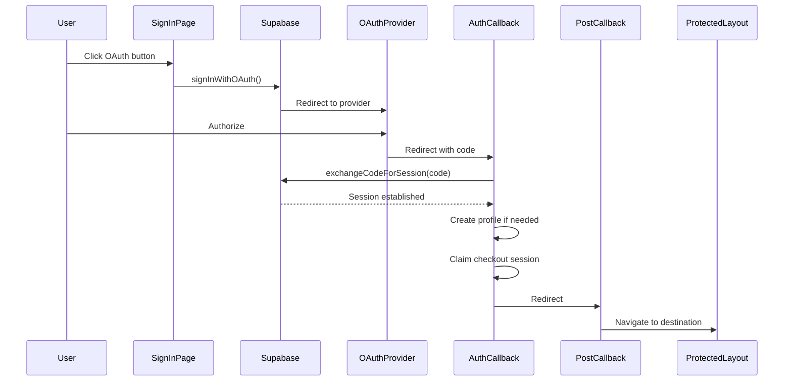

**Evidence:** `app/auth/callback/route.ts:68-88`
```typescript
if (code) {
  try {
    const supabase = await createServerSupabaseClient();
    const { data, error } = await supabase.auth.exchangeCodeForSession(code);

    if (error) {
      console.error("[AuthCallback] Code exchange failed:", error.message);
      if (type === "recovery") {
        return NextResponse.redirect(new URL("/reset-password?error=expired", baseUrl));
      }
      return NextResponse.redirect(new URL("/sign-in?error=auth_callback_failed", baseUrl));
    }
    console.log(`[AuthCallback] Session established for user: ${data.user?.id}`);
```

### 1.2 Protected Route Guard

**Code Path:** `app/(protected)/layout.tsx:37-118`

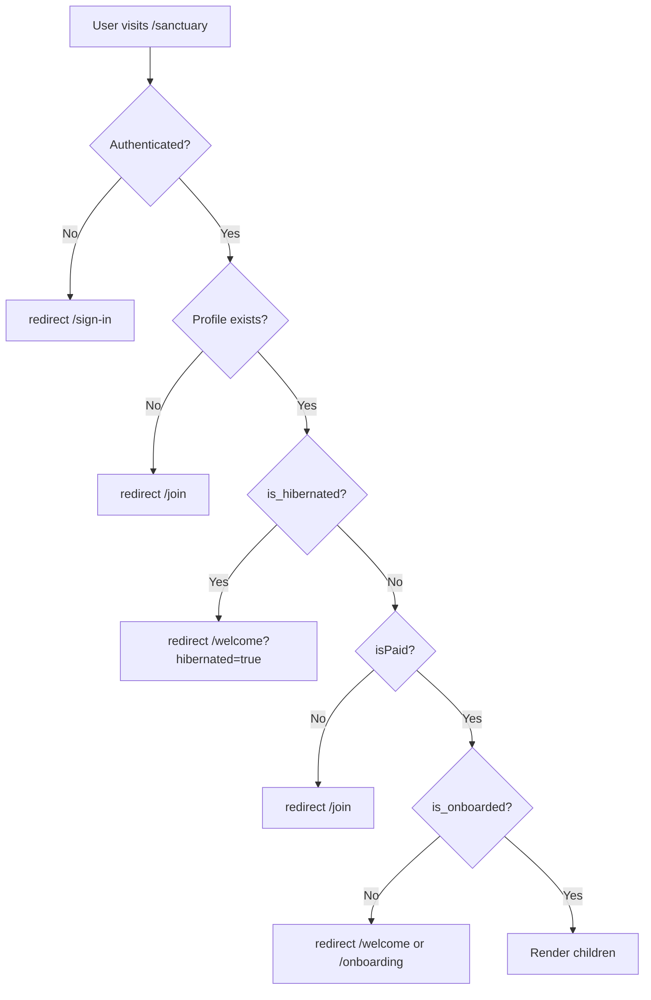

**Evidence:** `app/(protected)/layout.tsx:42-101`
```typescript
// Auth guard: Check if user is authenticated
const supabase = await createServerSupabaseClient();
const { data: { user } } = await supabase.auth.getUser();
if (!user) { redirect("/sign-in"); }

// Fetch user profile
const { data: profile } = await supabase.from("profiles")
  .select("*").eq("id", user.id).single();
if (!profile) { redirect("/join"); }

// Hibernation gate
if (typedProfile.is_hibernated === true) {
  redirect("/welcome?hibernated=true");
}

// Check if user has paid access
const isPaid = devBypass ||
  typedProfile.role === "admin" ||
  typedProfile.is_comped === true ||
  (typedProfile.membership_plan !== "none" &&
   (typedProfile.subscription_status === "trialing" ||
    typedProfile.subscription_status === "active"));

if (!isPaid) { redirect("/join"); }

// Onboarding check
if (!isReady) {
  if (typedProfile.onboarding_started_at) {
    redirect("/onboarding");
  } else {
    redirect("/welcome");
  }
}
```

---

## 2. Payment Flow

### 2.1 Checkout Session Creation

**Code Path:** `app/api/stripe/checkout/route.ts:5-80`

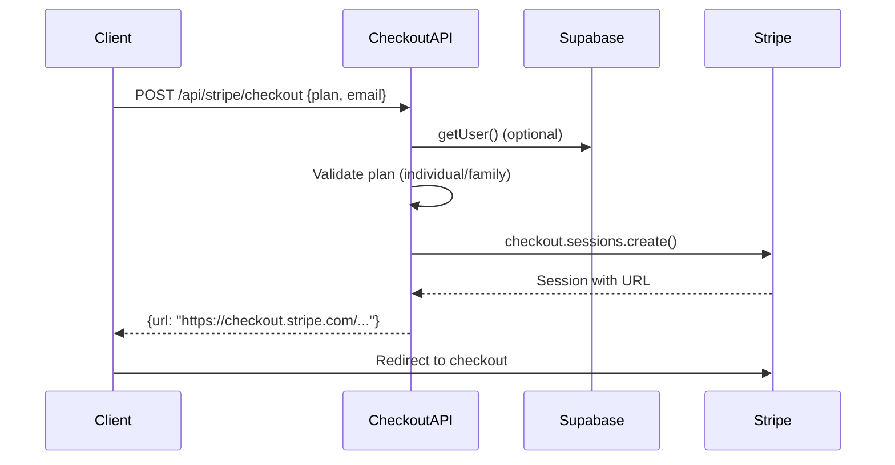

**Evidence:** `app/api/stripe/checkout/route.ts:49-70`
```typescript
const session = await stripe.checkout.sessions.create({
  mode: "subscription",
  payment_method_types: ["card"],
  line_items: [{ price: priceId, quantity: 1 }],
  customer_email: email,
  metadata: {
    plan,
    userId: user?.id || "",
  },
  subscription_data: {
    trial_period_days: 7,
  },
  success_url: `${appUrl}/welcome?status=success&session_id={CHECKOUT_SESSION_ID}`,
  cancel_url: `${appUrl}/`,
});
```

### 2.2 Webhook Processing

**Code Path:** `app/api/stripe/webhook/route.ts:85-158`

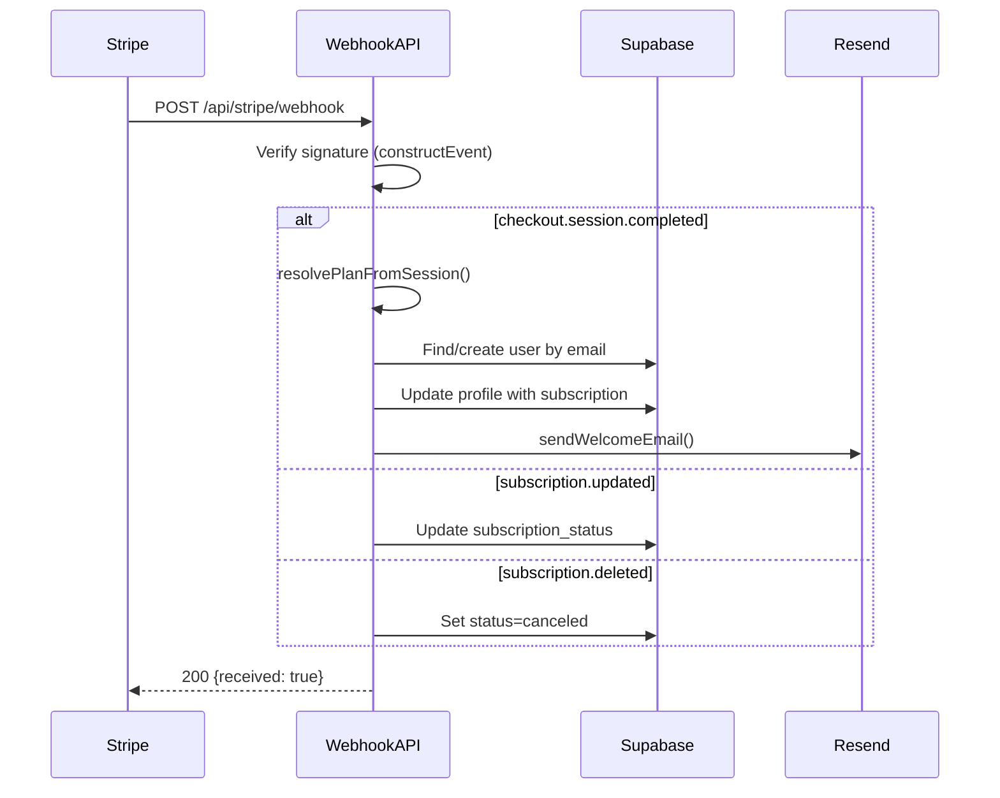

**Evidence - Signature Verification:** `app/api/stripe/webhook/route.ts:106-120`
```typescript
let event: Stripe.Event;
try {
  event = stripe.webhooks.constructEvent(
    body,
    signature,
    STRIPE_CONFIG.webhookSecret
  );
} catch (err: any) {
  console.error("[Webhook] Signature verification failed:", err.message);
  return NextResponse.json({ error: "Invalid signature" }, { status: 400 });
}
```

**Evidence - Profile Update:** `app/api/stripe/webhook/route.ts:280-309`
```typescript
const updateData = {
  membership_plan: plan,
  stripe_customer_id: customerId,
  stripe_subscription_id: subscriptionId,
  subscription_status: subscriptionStatus,
  subscription_start_date: new Date().toISOString(),
};

const { error: updateError } = await supabase
  .from("profiles")
  .update(updateData)
  .eq("id", profileUserId);
```

---

## 3. AI Insight Generation Flow

### 3.1 Request with Caching + Rate Limiting

**Code Path:** `app/api/insights/route.ts:63-703`

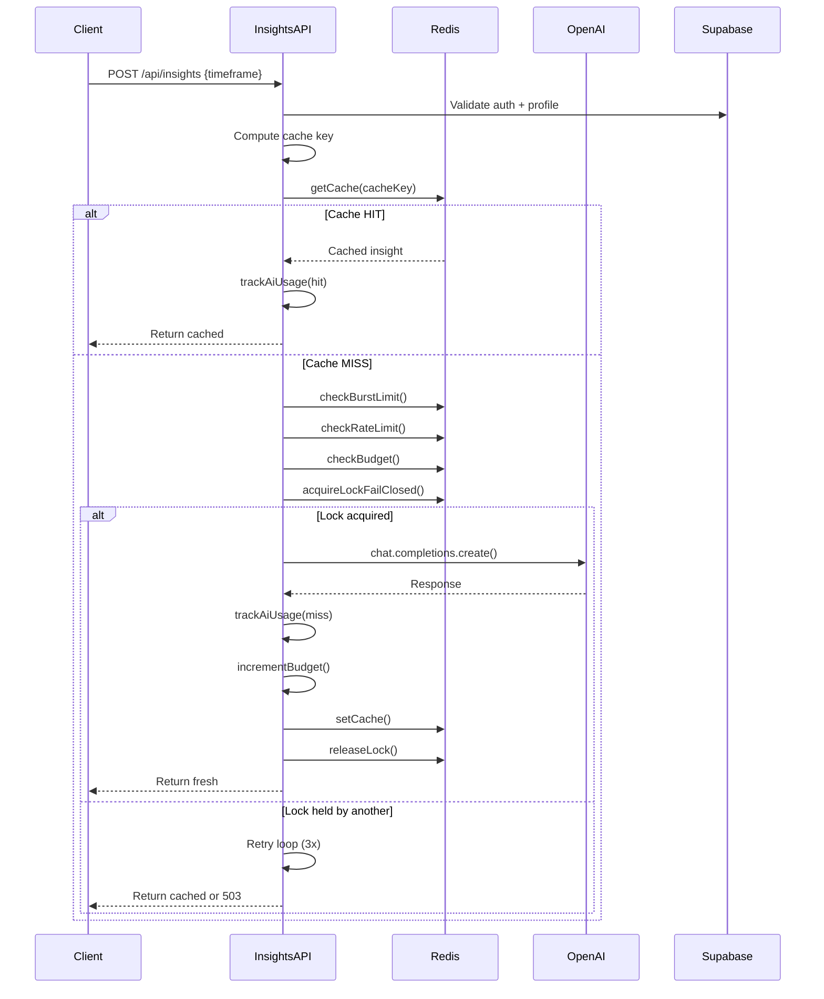

**Evidence - Cache Check:** `app/api/insights/route.ts:220-267`
```typescript
const cachedInsight = await getCache<SanctuaryInsight>(cacheKey);
if (cachedInsight) {
  console.log(`[Insights] ✓ Cache hit for ${cacheKey}`);
  void trackAiUsage({
    featureLabel: cachedFeatureLabel,
    cacheStatus: "hit",
    inputTokens: 0, outputTokens: 0, totalTokens: 0,
    // ...
  });
  return NextResponse.json(normalizeInsight(cachedInsight));
}
```

**Evidence - Rate Limiting:** `app/api/insights/route.ts:275-326`
```typescript
// Burst check (bot defense - 20 requests in 10 seconds)
const burstResult = await checkBurstLimit(`insights:${user.id}`, BURST_LIMIT, BURST_WINDOW);
if (!burstResult.success) {
  return createApiErrorResponse({
    error: "rate_limited",
    message: "Slow down — you're generating insights too quickly.",
    status: 429,
  });
}

// Sustained rate limit (60 generations per hour)
const rateLimitResult = await checkRateLimit(
  `insights:rate:${user.id}`, USER_RATE_LIMIT, USER_RATE_WINDOW
);
if (!rateLimitResult.success) {
  return createApiErrorResponse({
    error: "rate_limited",
    status: 429,
  });
}
```

**Evidence - Budget Check:** `app/api/insights/route.ts:408-419`
```typescript
const budgetCheck = await checkBudget();
if (!budgetCheck.allowed) {
  console.warn("[Insights] Budget exceeded, rejecting request");
  return createApiErrorResponse({
    error: "service_unavailable",
    message: "The cosmic treasury needs to restock. Try again later.",
    errorCode: INSIGHTS_ERROR_CODES.BUDGET_EXCEEDED,
    status: 503,
  });
}
```

**Evidence - Fail-Closed Lock:** `app/api/insights/route.ts:421-434`
```typescript
const lockResult = await acquireLockFailClosed(lockKey, 60);
if (lockResult.redisDown) {
  console.warn("[Insights] Redis unavailable during lock, failing closed");
  return createApiErrorResponse({
    error: "service_unavailable",
    message: "Our cosmic connection is temporarily down. Please try again shortly.",
    errorCode: INSIGHTS_ERROR_CODES.REDIS_UNAVAILABLE,
    status: 503,
  });
}
```

### 3.2 Cost Control Circuit Breaker

**Code Path:** `lib/ai/costControl.ts:77-105`

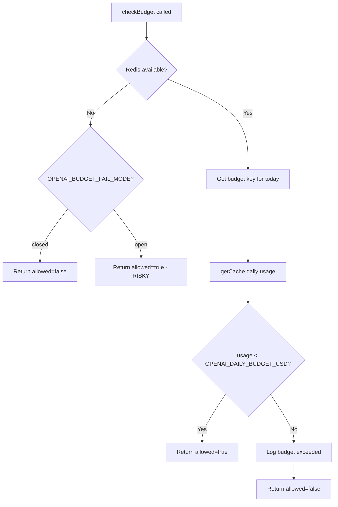

**Evidence:** `lib/ai/costControl.ts:77-105`
```typescript
export async function checkBudget(): Promise<BudgetCheckResult> {
  const limit = getDailyBudgetLimit();
  const failMode = getFailMode();

  try {
    const key = getBudgetKey();
    const used = (await getCache<number>(key)) || 0;
    const remaining = Math.max(0, limit - used);
    const allowed = used < limit;

    if (!allowed) {
      console.warn(`[CostControl] Daily budget exceeded: $${used.toFixed(4)} / $${limit}`);
    }
    return { allowed, used, limit, remaining };
  } catch (error: any) {
    if (failMode === "closed") {
      console.warn("[CostControl] Redis unavailable, failing closed");
      return { allowed: false, used: 0, limit, remaining: 0 };
    }
    console.warn("[CostControl] Redis unavailable, failing open (risky!)");
    return { allowed: true, used: 0, limit, remaining: limit };
  }
}
```

---

## 4. Social Integration Flow

### 4.1 OAuth Token Encryption

**Code Path:** `lib/social/crypto.ts:41-83`

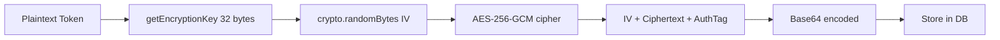

**Evidence - Encryption:** `lib/social/crypto.ts:41-60`
```typescript
export function encryptToken(plaintext: string): string {
  const key = getEncryptionKey();
  const iv = crypto.randomBytes(IV_LENGTH);  // 16 bytes random IV

  const cipher = crypto.createCipheriv(ALGORITHM, key, iv);  // aes-256-gcm

  let encrypted = cipher.update(plaintext, "utf8", "base64");
  encrypted += cipher.final("base64");

  const authTag = cipher.getAuthTag();

  // Combine: IV (16 bytes) + encrypted data + auth tag (16 bytes)
  const combined = Buffer.concat([
    iv,
    Buffer.from(encrypted, "base64"),
    authTag,
  ]);

  return combined.toString("base64");
}
```

**Evidence - Decryption:** `lib/social/crypto.ts:66-83`
```typescript
export function decryptToken(encryptedData: string): string {
  const key = getEncryptionKey();
  const combined = Buffer.from(encryptedData, "base64");

  // Extract components
  const iv = combined.subarray(0, IV_LENGTH);
  const authTag = combined.subarray(combined.length - AUTH_TAG_LENGTH);
  const encrypted = combined.subarray(IV_LENGTH, combined.length - AUTH_TAG_LENGTH);

  const decipher = crypto.createDecipheriv(ALGORITHM, key, iv);
  decipher.setAuthTag(authTag);

  let decrypted = decipher.update(encrypted);
  decrypted = Buffer.concat([decrypted, decipher.final()]);

  return decrypted.toString("utf8");
}
```

### 4.2 Social Stale Check + Sync Trigger

**Code Path:** `app/api/insights/route.ts:191-214` -> `lib/social/staleness.ts`

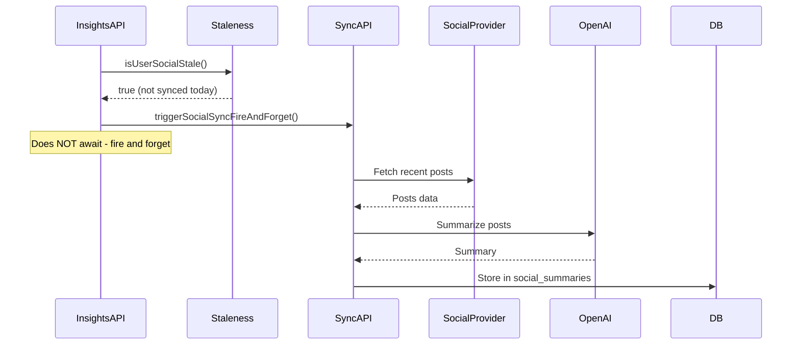

**Evidence:** `app/api/insights/route.ts:191-214`
```typescript
if (timeframe === "today" && admin && profile.social_insights_enabled) {
  try {
    const isStale = await isUserSocialStale(
      user.id,
      effectiveTimezone,
      profile.last_social_sync_local_date,
      admin
    );

    if (isStale) {
      // Fire and forget - don't await completion
      void triggerSocialSyncFireAndForget(user.id, baseUrl, cronSecret, cookieHeader);
    }
  } catch (staleSyncError) {
    // Log and continue - social sync failure should never block insights
    console.warn("[Insights] Social stale check failed, skipping:", staleSyncError);
  }
}
```

---

## 5. Rate Limiting Flow

### 5.1 Redis-based Rate Limiting with Fallback

**Code Path:** `lib/cache/rateLimit.ts:102-121`

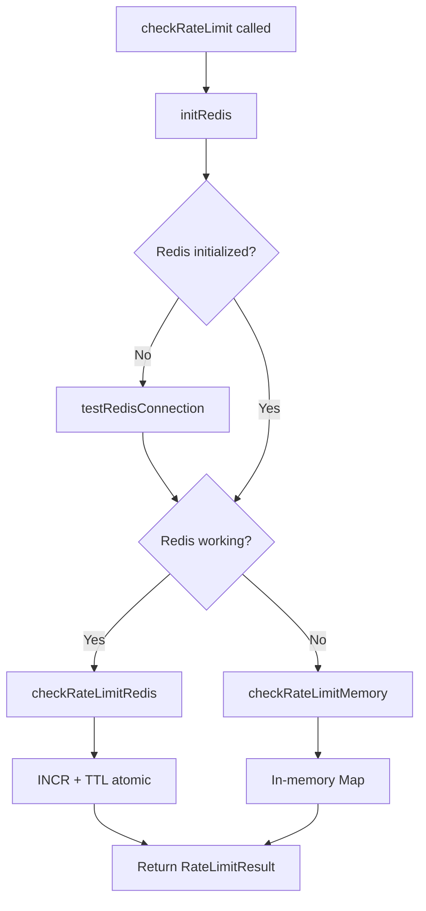

**Evidence - Redis Rate Limit:** `lib/cache/rateLimit.ts:123-163`
```typescript
async function checkRateLimitRedis(key, limit, windowSeconds): Promise<RateLimitResult> {
  try {
    const multi = redis!.multi();
    multi.incr(key);
    multi.ttl(key);

    const results = await multi.exec();
    const count = results[0][1] as number;
    let ttl = results[1][1] as number;

    // Set expiry on first request in window
    if (ttl === -1) {
      await redis!.expire(key, windowSeconds);
      ttl = windowSeconds;
    }

    const resetAt = Date.now() + ttl * 1000;
    const remaining = Math.max(0, limit - count);

    return {
      success: count <= limit,
      remaining,
      resetAt,
      limit,
      backend: "redis",
      count,
    };
  } catch (error) {
    // Fallback to memory on Redis error
    redisWorking = false;
    return checkRateLimitMemory(key, limit, windowSeconds);
  }
}
```

**Evidence - Memory Fallback:** `lib/cache/rateLimit.ts:165-205`
```typescript
function checkRateLimitMemory(key, limit, windowSeconds): RateLimitResult {
  const now = Date.now();
  const windowMs = windowSeconds * 1000;

  let entry = memoryStore.get(key);

  // Create new entry or reset expired entry
  if (!entry || entry.resetAt < now) {
    entry = { count: 1, resetAt: now + windowMs };
    memoryStore.set(key, entry);
    return {
      success: true,
      remaining: limit - 1,
      backend: "memory",
      // ...
    };
  }

  // Increment existing entry
  entry.count++;
  return {
    success: entry.count <= limit,
    backend: "memory",
    // ...
  };
}
```

---

## 6. Error Handling Flow

### 6.1 Standardized API Error Response

**Code Path:** `lib/api/errorResponse.ts:30-62`

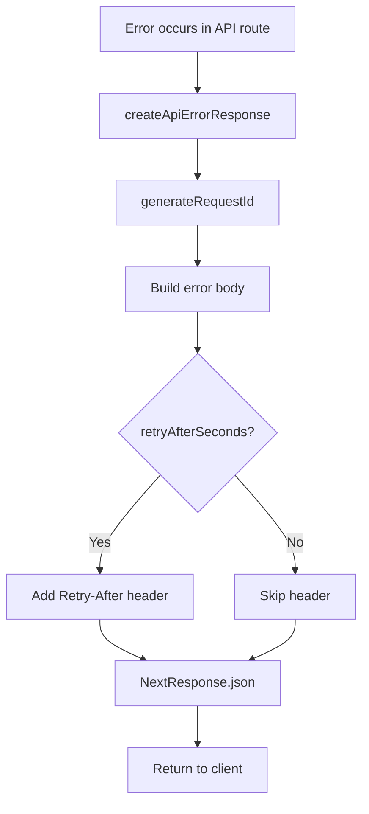

**Evidence:** `lib/api/errorResponse.ts:30-62`
```typescript
export function createApiErrorResponse(options: ApiErrorOptions): NextResponse {
  const {
    error,
    message,
    errorCode,
    status,
    retryAfterSeconds,
    route,
    requestId = generateRequestId(),
  } = options;

  const body: Record<string, unknown> = {
    error,
    message,
    errorCode,
    requestId,
  };

  if (retryAfterSeconds !== undefined) {
    body.retryAfterSeconds = retryAfterSeconds;
  }

  const headers: Record<string, string> = {};
  if (retryAfterSeconds !== undefined) {
    headers["Retry-After"] = String(retryAfterSeconds);
  }

  return NextResponse.json(body, { status, headers });
}
```

**Error Codes:** `lib/api/errorResponse.ts:67-133`
```typescript
export const INSIGHTS_ERROR_CODES = {
  COOLDOWN: "INSIGHTS_COOLDOWN",
  RATE_LIMIT: "INSIGHTS_RATE_LIMIT",
  LOCK_BUSY: "INSIGHTS_LOCK_BUSY",
  BUDGET_EXCEEDED: "INSIGHTS_BUDGET_EXCEEDED",
  REDIS_UNAVAILABLE: "INSIGHTS_REDIS_UNAVAILABLE",
  PROVIDER_ERROR: "INSIGHTS_PROVIDER_ERROR",
  INVALID_PROFILE: "INSIGHTS_INVALID_PROFILE",
  INVALID_TIMEFRAME: "INSIGHTS_INVALID_TIMEFRAME",
  UNAUTHORIZED: "INSIGHTS_UNAUTHORIZED",
};
```

---

## 7. Translation Flow

### 7.1 Server-Side Language Selection

**Code Path:** Profile -> API -> Translation lookup

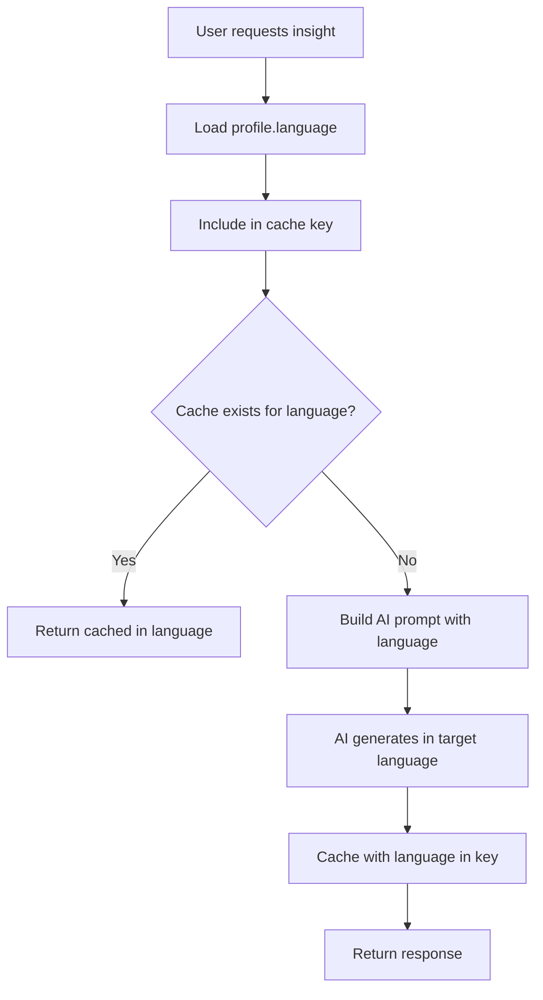

**Evidence - Cache Key with Language:** `app/api/insights/route.ts:179-183`
```typescript
// Get user's language preference (default to English)
const targetLanguage = profile.language || "en";

// Build cache and lock keys
const cacheKey = buildInsightCacheKey(user.id, timeframe, periodKey, targetLanguage, PROMPT_VERSION);
```

**Evidence - AI Prompt Language Instruction:** `app/api/insights/route.ts:484-498`
```typescript
const systemPrompt = `${ayrenVoice}
${PRO_SOCIAL_NUDGE_INSTRUCTION}
${HUMOR_INSTRUCTION}
${LOW_SIGNAL_GUARDRAIL}

LANGUAGE:
- Write ALL narrative text in language code: ${targetLanguage}
- Field names in JSON remain in English, but all content values must be in the user's language
// ...
`;
```

---

*Data flow documentation for Solara Insights*
